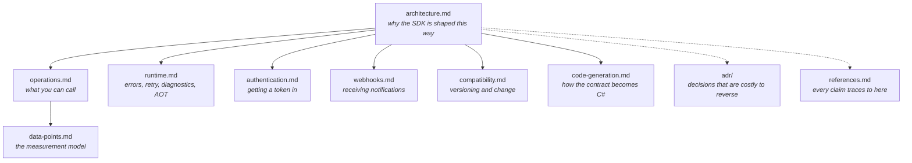

# Documentation

## Where to start

**Calling the API.** [`authentication.md`](authentication.md) to get a credential in, then
[`operations.md`](operations.md) for the surface, then [`runtime.md`](runtime.md) for what happens
when a call fails. If you are reading or writing measurements — which is most of the API —
[`data-points.md`](data-points.md) covers the union type, the three-part timestamps and the data
type catalogue.

**Receiving notifications.** [`webhooks.md`](webhooks.md) on its own. It shares the timestamp
types with the REST client and nothing else: no `HealthDataClient`, no operation descriptors, no
access tokens. It has an `HttpClient` of its own for fetching Google's keyset, and an endpoint
secret to compare against — so "no credentials" would be wrong, but they are not the REST client's.
It can be read without any of the above.

**Deciding whether to depend on this.** [`architecture.md`](architecture.md) and
[`compatibility.md`](compatibility.md).

**Changing this repository.** [`architecture.md`](architecture.md) for the rules that must not
regress, [`code-generation.md`](code-generation.md) before touching anything under `Generated/`,
and [`adr/`](adr/README.md) before making a decision that is expensive to undo.

## Scope of each document

| Document | Owns | Does not cover |
|---|---|---|
| [`architecture.md`](architecture.md) | Design intent, package boundaries, the fact/decision distinction, known documentation conflicts | How to use any specific feature |
| [`operations.md`](operations.md) | Every exposed operation, its scope, retry class and pagination | Credentials, error handling |
| [`data-points.md`](data-points.md) | The `DataPoint` union, timestamps, filters, roll-ups, the data type catalogue | The operation list itself |
| [`runtime.md`](runtime.md) | Errors, retry, diagnostics, AOT and trimming | The contract itself |
| [`authentication.md`](authentication.md) | OAuth, project credentials, token providers, scopes | Token storage, which this SDK does not do |
| [`webhooks.md`](webhooks.md) | Signature verification, endpoint challenges, notification payload | The REST client |
| [`compatibility.md`](compatibility.md) | SemVer policy, how a contract change is caught | Why the design is what it is |
| [`code-generation.md`](code-generation.md) | Spec files, generator pipeline, determinism | Runtime behaviour |
| [`adr/`](adr/README.md) | One decision per record, with the context that forced it | Anything reversible |
| [`references.md`](references.md) | The primary sources every claim traces to | Anything not checkable |

Nothing is explained in two places. Where a topic touches two documents, one owns the explanation
and the other links to it.
