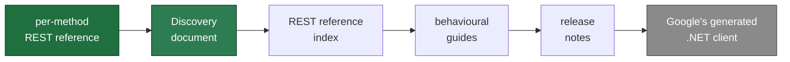
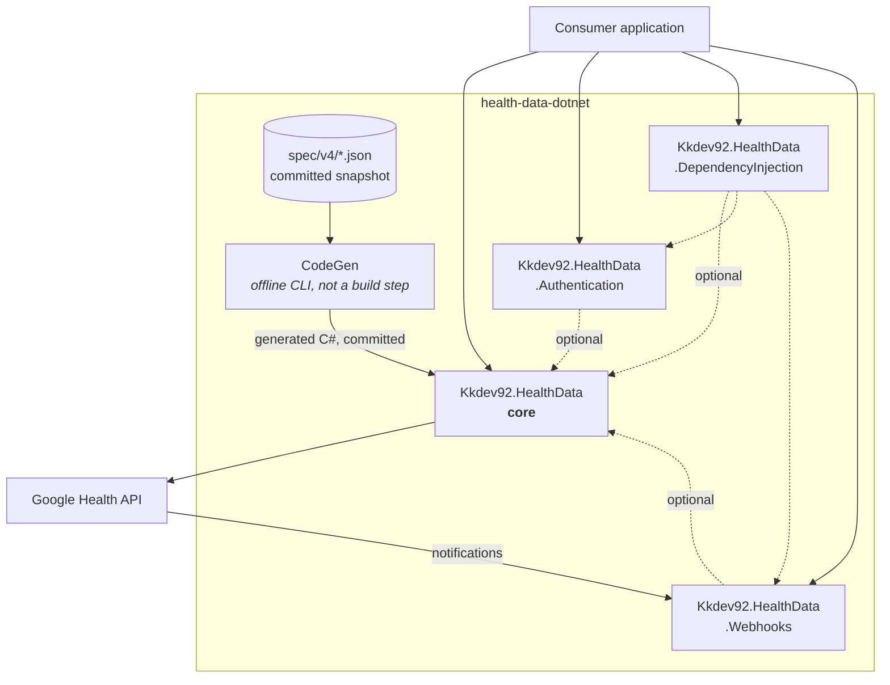
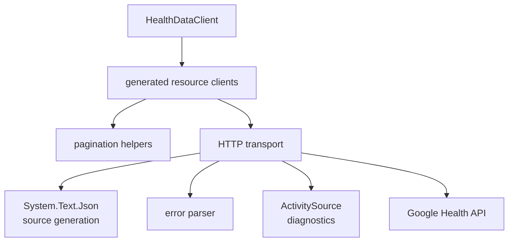
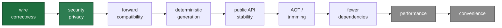
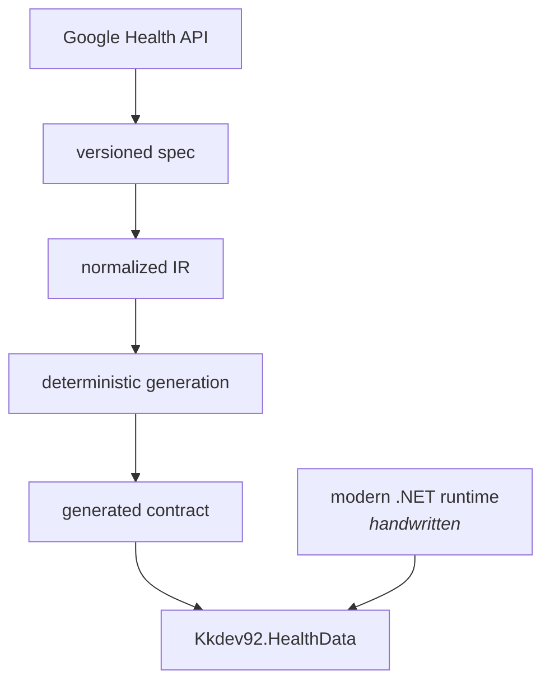

# Architecture

Design intent, package boundaries, and the rules that hold the rest of the repository together.

In one sentence: **an unofficial, version-neutral .NET SDK that takes the Google Health API's
official REST contract in as a versioned specification and turns it into C# by deterministic code
generation, around a runtime written for modern .NET.**

The current public contract is v4. The library is deliberately not designed as a v4 wrapper.

## Facts, decisions, and the difference between them

The most important habit in this repository is refusing to blur four categories:

| Category | Meaning | Example |
|---|---|---|
| **Verified fact** | Confirmed in a Google or Microsoft primary source | Discovery revision, wire query name |
| **Design decision** | A choice this SDK makes and owns | Open enums, retry being opt-in |
| **Documentation conflict** | Google's own sources disagree | The `Subscriber` write response |
| **Integration-test required** | Documents alone cannot settle it | Whether `Operation.done` is ever `false` |

Anything in the last two categories is recorded rather than quietly resolved — in
`spec/v4/semantics.json` with provenance per entry, or as an [ADR](adr/README.md).

### Which Google source wins



That ranking is a design decision, not something Google published. What follows from it is
enforced by tests:

- Query parameter names are never inferred from prose.
- Discovery wire names are never re-cased or reshaped.
- Request and response types are never decided from a guide's code sample.
- An operation is not public merely because Discovery contains it.
- Conflicts are written down, not smoothed over.

### Known documentation conflicts

This table is canonical; other documents point here rather than restating it. Verified
2026-08-10 against Discovery revision `20260805`; the scopes row re-verified 2026-08-31 against
revision `20260826`.

| Topic | Google's sources disagree | Resolution | Detail |
|---|---|---|---|
| Subscriber `create` / `patch` response | Webhooks guide shows a `Subscriber`; Discovery and the method reference say `Operation` | `Operation` | [operations.md](operations.md#clientprojectssubscribers) |
| Endpoint verification success status | Guide allows `200` or `201`; method reference requires `201` | `201`, the stricter | [webhooks.md](webhooks.md#endpoint-verification) |
| Which scopes an operation accepts | No Google source lists them all: `location.writeonly` left Discovery at revision `20260826` but `create`, `patch` and `batchDelete` still document it; `nutrition.readonly` has never been in Discovery | The union of Discovery and the per-method reference; both scopes are generated | [authentication.md](authentication.md#scopes) |
| `dataPoints.dailyRollUp` pagination | Request accepts a page token; the response returns none | No enumeration helper is generated | [operations.md](operations.md#clientusersdatapoints) |

Each is pinned by a test, so a future contract refresh that silently changes one of them fails the
build rather than changing behaviour.

## What Google decides, and what this SDK decides

| Google | This SDK |
|---|---|
| Service endpoint, REST path, HTTP method | C# namespaces and type names |
| Wire query and JSON names | Public API ergonomics |
| OAuth scopes | `HttpClient` integration |
| Server-side validation | Serialization strategy |
| Data type semantics | AOT and trimming policy |
| Quota and rate limits | Pagination helpers, retry policy |
| Webhook protocol | Error abstraction, diagnostics, DI |
| | Code generation architecture, package versioning |

The wire contract is not bent for convenience. Equally, Google's general-purpose .NET client
runtime design is not adopted just because it exists.

## Why not the official client

Not because it cannot be used: `google-api-dotnet-client` supports .NET 6.0+ and runs fine on
.NET 10. The reason is control over the things that make a modern .NET SDK — targeting `net10.0`
directly, reflection-free JSON, Native AOT and trimming, allocation and streaming behaviour, the
`HttpClient` pipeline, unknown field and enum handling, semantic overrides, retry policy,
diagnostics, dependency count, and API version migration. See
[ADR-0002](adr/0002-no-google-apis-runtime-dependency.md).

## Goals and non-goals

**Goals.** Modern .NET native (`net10.0`, C# 14, Native AOT, trimming, `System.Text.Json` source
generation). Zero third-party runtime dependencies in the core. Deterministic code generation, so
endpoints and DTOs are never hand-synchronized. Forward compatibility under additive change. API
version neutrality. Fidelity to the REST API, with .NET-shaped conveniences layered on top rather
than substituted for it. Privacy by default. Observability. Testability without a network.

**Non-goals for 1.0.** Reimplementing the service. A Fitbit Web API compatibility layer. A generic
Discovery generator for all Google APIs. A Google Cloud SDK replacement. OAuth UI. A production
secret vault. FHIR or the Cloud Healthcare API. A common abstraction over Apple Health, Health
Connect or Garmin. gRPC. v1 is REST-first ([ADR-0001](adr/0001-rest-first.md)).

## Structure



Webhooks points the other way on purpose: it is called rather than calling, for everything that
carries health data. The one call it makes is its own — fetching Google's published keyset, so it
has something to verify a signature against.

Inside the core package:



## Package responsibilities

| Package | Owns | Third-party runtime dependencies |
|---|---|---|
| `Kkdev92.HealthData` | Resource clients, generated models, request construction, serialization, error parsing, pagination, media streaming, request metadata, diagnostics, an optional BCL-only retry handler | none |
| `Kkdev92.HealthData.Authentication` | Authorization URL, authorization-code and refresh exchange, PKCE, scope model, access token model, authorization handler, token provider abstraction | none |
| `Kkdev92.HealthData.DependencyInjection` | `IServiceCollection` wiring, `IHttpClientFactory`, options binding, handler composition | `Microsoft.Extensions.*` only |
| `Kkdev92.HealthData.Webhooks` | Raw-payload signature verification, keyset fetch and cache, endpoint verification, notification models | none |

The DI package exists so the core never has to reference `Microsoft.Extensions.*`. Webhooks is
separate because receiving a notification is not the same responsibility as calling a REST API.
Neither Authentication nor Webhooks ships a token store or secret vault; that is the consuming
application's job.

## Public API shape

Resource-oriented, mirroring the REST resource tree. Every network method takes a request object,
ends in `Async`, accepts a `CancellationToken`, and returns `Task<T>`.

```csharp
var profile = await client.Users.GetProfileAsync(
    new GetProfileRequest { Name = UserName.Me.Profile },
    cancellationToken);
```

The full catalogue is in [operations.md](operations.md).

**There is no large public interface.** Resource clients are `sealed` concrete classes. A
generated interface at the centre of the public contract would break every implementer each time
Google adds a method, and would exist mainly to be mocked — a fake `HttpMessageHandler` tests the
same thing more honestly, against the actual wire contract.

**The client owns neither an `HttpClient` nor a credential.** One is supplied so its lifetime,
handler pipeline and timeouts stay with the application; authorization is attached by a delegating
handler that reads the operation descriptor off the request. That is what makes a single client
safe to share across users in a server. See [ADR-0007](adr/0007-authentication-via-request-pipeline.md)
for the decision and [authentication.md](authentication.md) for how to wire it.

## Privacy by default

This API carries health data, so the defaults are stricter than a general SDK would need:

- The SDK writes no logs at all — it takes no logger and holds no `Console` or `Trace` call — so
  nothing it handles can leak through one. It emits `ActivitySource` events instead, whose tag list
  is deliberately short and is fixed by a test.
- Exception messages are built from the status code, the operation id and an **allowlisted** error
  code. The server's own wording stays on the exception's `Error` property, where reaching it is a
  deliberate act rather than the default of logging `ex.Message`.
- Models are classes rather than records, so they inherit `object.ToString()` instead of printing
  every property, and `HealthDataAccessToken.ToString()` reports only the expiry. The exceptions
  are the types whose whole purpose is to render a value — `GoogleTimestamp` and the other wire
  primitives, and `HealthDataRequestBuilder`, which returns the URL it just built.
- Webhook signatures are verified against the **raw received bytes, before parsing**, so the
  ordering is structural rather than a rule to remember.
- Error response bodies are read under a byte bound rather than buffered freely.

These are enforced as tests, not intentions — see `PrivacyGuardTests`. What is and is not emitted
in diagnostics is in [runtime.md](runtime.md#diagnostics).

## When decisions conflict



The wire contract is not bent for convenience, and correctness is not traded for performance.

## Rules that must not regress

1. No `LangVersion` of `latest` or `preview`.
2. No undocumented nanosecond precision assumed for `google-datetime`.
3. Wire names are never transformed by a naming convention.
4. Subscriber create and patch responses are never assumed to be `Subscriber`.
5. No public `OperationsResource` is invented; the API exposes no polling resource.
6. Webhook signatures are verified against the raw body.
7. `HttpClient.Timeout` is never assumed to cover the body under `ResponseHeadersRead`.
8. The Scopes guide is never the sole source for scope generation.
9. An operation is not public just because Discovery contains it.
10. Health payloads and tokens never reach an exception message, and the SDK emits no logs of its
    own for them to reach.

## Why the separation matters



A future v4 successor, a new data type, a webhook extension, a newer .NET, or an additive contract
change can all be absorbed without moving the package identity or rewriting the runtime. The point
of this SDK is not to copy Google's client. It is to take the wire contract Google publishes and
deliver it in a form that is traceable, generatable, and verifiable.
