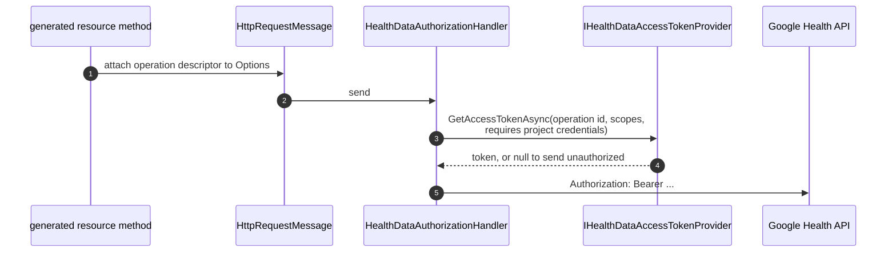

# Authentication

## Two credential contexts, not one

The Google Health API is authorized two different ways, and a single token field cannot serve
both ([ADR-0007](adr/0007-authentication-via-request-pipeline.md)):

| Surface | Credential | Scopes |
|---|---|---|
| `users.*`, `users.dataTypes.dataPoints.*`, `users.pairedDevices.*` | End-user OAuth grant | `googlehealth.*` |
| `projects.subscribers.*` | Project credentials | `cloud-platform` |

Every generated operation carries a descriptor saying which it needs, and the SDK hands that to
your token provider on each call. Of the 25 operations, 8 use project credentials — everything
under `projects.subscribers`. The per-operation breakdown is in
[operations.md](operations.md).

**One token cannot carry both, and the service enforces that.** It is not that two credentials are
merely tidier: a grant that includes `cloud-platform` alongside the `googlehealth.*` scopes is
refused by every user-facing operation, before it does anything.

```text
403 PERMISSION_DENIED
reason   DISALLOWED_OAUTH_SCOPES
message  Request contains disallowed OAuth scope(s).
metadata disallowed_scopes = cloud_platform
```

So the two contexts are two credentials, obtained separately and kept apart, and the subscriber
operations are meant for a service account rather than for anybody's consent screen. If you add
`cloud-platform` to an end user's grant to save a step, reading their data stops working.

The practical consequence when you set the project side up: `getIdentity` is a user operation, and
a subscription needs the `healthUserId` it returns. Read that with the user's credential and keep
it; the credential that may create the subscription is not allowed to ask.

## The client holds no credentials

Authorization is a pipeline concern. A delegating handler reads the operation descriptor from the
request and asks an `IHealthDataAccessTokenProvider` for a token:



The handler asks per request, never per client. That is what makes one client safe to share across
users; a token stored on a singleton client is exactly what this model exists to prevent.

### A single user

```csharp
var authorization = new HealthDataAuthorizationHandler(new StaticAccessTokenProvider(token))
{
    InnerHandler = new HttpClientHandler(),
};

using var httpClient = new HttpClient(authorization)
{
    BaseAddress = HealthDataApiMetadata.DefaultBaseAddress,
};

var client = new HealthDataClient(httpClient);
```

### A server serving many users

Register a scoped provider that reads whatever per-request context you already have:

```csharp
services.AddHealthData();

services.AddHealthDataAccessToken(async (provider, request, cancellationToken) =>
{
    var user = provider.GetRequiredService<ICurrentUser>();

    // request.OperationId, request.Scopes and request.RequiresProjectCredentials are available
    // here, so a subscriber-administration call can use project credentials instead.
    var token = request.RequiresProjectCredentials
        ? await projectCredentials.GetAsync(cancellationToken)
        : await userTokens.GetAsync(user.Id, cancellationToken);

    return token;
});
```

No token provider is registered by default. Resolving `HealthDataClient` without one throws at
composition time, which points at the mistake rather than surfacing later as a 401.

## Obtaining a token

Endpoints, verified against Google's Health API setup guide on 2026-08-10:

| | |
|---|---|
| Authorization | `https://accounts.google.com/o/oauth2/v2/auth` |
| Token | `https://oauth2.googleapis.com/token` |

```csharp
var oauth = new GoogleOAuthClient(httpClient, new GoogleOAuthOptions
{
    ClientId = "....apps.googleusercontent.com",
    // Sent exactly as written. Google compares it to the registered value character for
    // character, so give it the registered string; a blank client id or a relative URI is
    // rejected here rather than by Google.
    RedirectUri = new Uri("https://example.test/callback"),
    // ClientSecret only for a confidential client. A desktop, mobile or SPA client cannot keep
    // one; use PKCE instead.
});

var pkce = PkceCodeChallenge.Create();

var url = oauth.CreateAuthorizationUrl(
    [HealthDataScopes.ActivityAndFitnessReadonly, HealthDataScopes.SleepReadonly],
    state: antiForgeryToken,
    pkce: pkce);

// ... send the user to url, receive ?code= and ?state= at the redirect URI ...
```

The callback is a separate request, and this is where it goes wrong. **Look the pending
authorization up by the session, never by anything the caller sent.**

```csharp
// On /connect/start. One record, keyed by the session that is starting the flow.
var pending = new PendingAuthorization(
    State: RandomNumberGenerator.GetHexString(64),
    Verifier: PkceCodeChallenge.Create().CodeVerifier);

await store.SaveAsync(session.Id, pending, cancellationToken);

var url = oauth.CreateAuthorizationUrl(new GoogleAuthorizationUrlOptions
{
    // The generated sets, so an application that only reads does not have to work out which
    // scopes those are by matching on their names.
    Scopes = HealthDataScopes.ReadOnly,
    State = pending.State,
    Pkce = PkceCodeChallenge.FromVerifier(pending.Verifier),
});

// On /connect/callback, possibly in a different instance.
//
// Keyed by the session. Looking the record up by the received state instead finds the attacker's
// own pending record and then compares it with itself — which proves that some flow started, not
// that this browser started it. That is the hole login CSRF goes through: the victim's session
// ends up holding tokens for the attacker's account.
var pending = await store.TakeAsync(session.Id, cancellationToken);   // single use: removes it

if (pending is null || receivedState is null || !CryptographicOperations.FixedTimeEquals(
        Encoding.UTF8.GetBytes(pending.State), Encoding.UTF8.GetBytes(receivedState)))
{
    return Results.BadRequest();
}

// The verifier comes out of the same record, so it cannot be paired with a different flow.
var tokens = await oauth.ExchangeCodeAsync(
    code, PkceCodeChallenge.FromVerifier(pending.Verifier), cancellationToken);

var accessToken = GoogleOAuthClient.ToAccessToken(tokens);
```

Three properties, and the first is the one that is easy to miss:

| | |
|---|---|
| **Bound to the session** | The lookup key is the session, not a value the callback carried |
| **Compared exactly** | Existence is not a match |
| **Single use** | Take it rather than read it, so a replayed callback finds nothing |

Google's OAuth guidance requires the received state to match the sent state before the response is
processed, and the state to be unique and hard to guess. Binding it to the session is what makes
"the sent state" mean *this browser's* sent state.

### Refresh tokens

`CreateAuthorizationUrl` sends `access_type=offline` by default, which is how the setup guide says
to obtain a refresh token. Google returns one on first consent only, so losing it means sending
the user through consent again. Pass `forceConsent: true` (which sends `prompt=consent`) after
changing the requested scopes.

```csharp
var refreshed = await oauth.RefreshAsync(refreshToken, cancellationToken);
```

The refresh response usually omits `refresh_token`; the original stays valid.

> A project whose consent screen is set to an **external** user type with a publishing status of
> **Testing** is issued refresh tokens that expire in **7 days**. That surprises people who test
> for a week and then find everything broken. It is the publishing status that does it rather than
> verification as such, and the documented exception is a project requesting only name, email
> address and profile — which no Health API scope is.
>
> Outside that combination a refresh token lasts until something withdraws it. Google's list: the
> user revoked access, six months unused, the account exceeded its limit of live refresh tokens,
> time-based access expired, an administrator restricted a requested service, or — for Google Cloud
> Platform APIs — an administrator's session length was exceeded. A password change is on that list
> only for refresh tokens carrying Gmail scopes, which these are not.

### When the token endpoint refuses

`GoogleOAuthException` carries the RFC 6749 §5.2 error response. `invalid_grant` is the one worth
handling, and it covers more than one thing: the RFC defines it as a grant that is invalid,
expired or revoked, that does not match the redirect URI it was obtained with, or that was issued
to another client. So it is what a withdrawn refresh token comes back as, and what one that
expired under the Testing-status limit comes back as — and also what a changed client id or
redirect URI comes back as. Those want opposite responses, so it is worth telling them apart
before acting:

```csharp
try
{
    var refreshed = await oauth.RefreshAsync(refreshToken, cancellationToken);
}
catch (GoogleOAuthException ex) when (ex.ErrorCode == "invalid_grant")
{
    // Discarding the token and sending the user through consent is right when the grant is gone,
    // and useless when the client id or redirect URI has drifted from the one the grant was made
    // with — consent would produce another token this configuration also cannot use. Check the
    // configuration matches what the grant was obtained under before deciding.
    if (configuration.MatchesTheGrant())
    {
        await store.DiscardAsync(refreshToken, cancellationToken);
    }
}
```

### What is safe to log

| | Safe to log or paste into an issue | Why |
|---|---|---|
| `ex.Message` | **Yes** | Status, plus the error code when it is one RFC 6749 or RFC 8628 defines |
| `ex.StatusCode` | **Yes** | |
| `ex.Error?.ToString()` | **Yes** | The same allowlisted code, nothing else |
| `ex.ErrorCode` | **Only after comparing it** | Whatever the server sent, verbatim |
| `ex.Error?.ErrorSubtype` | **Only after comparing it** | Whatever the server sent, verbatim |
| `ex.Error?.ErrorDescription` | **No** | Whatever the server sent, verbatim |
| `ex.Error?.ErrorUri` | **No** | Whatever the server sent, verbatim |

`ErrorSubtype` is Google's, not the RFC's, and it is what separates a grant that is gone from a
session that ended: `invalid_grant` with `"error_subtype": "invalid_rapt"` means the user has to
reauthenticate rather than consent again.

The division is not about health data — a token endpoint response contains none. It is that RFC
6749 lets a server put anything in those fields, so a token endpoint, or a proxy in front of one,
that echoes a submitted value back would be handing you an authorization code or a client secret.
An allowlist of known codes is the only filter that tells a secret from an identifier, because
they are shaped alike. The properties are still there for a caller with somewhere safe to put
them.

### What this helper does not do

`GoogleOAuthClient` is an authorization-code client and nothing more. Two absences are worth
naming rather than leaving to be discovered:

| | |
|---|---|
| **DPoP** | Google's web-server flow documents a `DPoP` header that binds the returned tokens to a private key you hold, and describes it as optional but recommended for increased security. This helper does not generate the proof JWT, handle a `DPoP-Nonce` challenge, or retry on `use_dpop_nonce`. If you need sender-constrained tokens, use an OAuth library that implements it — the rest of this SDK takes a token from wherever you got it |
| **Token storage** | There is none, deliberately. Nothing here writes a refresh token anywhere, so where it lives and how it is protected is the application's decision |

Checked against Google's OAuth 2.0 web-server documentation on 2026-08-12.

### PKCE

The Health setup guide does not mention PKCE, so this SDK offers it rather than requiring it. Use
it for any client that cannot keep a secret. `PkceCodeChallenge` produces S256 only; RFC 7636's
`plain` method offers nothing worth having here.

The redirect and the callback are two separate requests, so a verifier kept only in a field
confines the flow to a single process that never restarts. Persist the verifier with the pending
authorization and rebuild the pair when the code arrives:

```csharp
// On /connect/start
var pkce = PkceCodeChallenge.Create();
await store.SaveAsync(state, pkce.CodeVerifier);   // a secret: session or database, then delete

// On /connect/callback, possibly in a different instance
var pkce = PkceCodeChallenge.FromVerifier(await store.TakeAsync(state));
var tokens = await oauth.ExchangeCodeAsync(code, pkce, cancellationToken);
```

## Scopes

Scopes come from the Discovery document plus the per-method reference pages, because **no single
Google source lists them all.** All three were compared on 2026-08-12:

| Scope | Discovery | Per-method pages | Scopes guide |
|---|---|---|---|
| `googlehealth.location.writeonly` | ✅ 4 operations | ❌ omitted by `reconcile` | ❌ not listed |
| `googlehealth.nutrition.readonly` | ❌ no operation declares it | ✅ 6 read operations | ✅ listed |
| `googlehealth.ecg.readonly` · `irn.readonly` | ✅ but not on `dataPoints.list` | ✅ on `dataPoints.list` | ✅ listed |
| `cloud-platform` | ✅ project administration | ✅ | ❌ (not an end-user scope) |

The two sources omit each other's scopes in both directions, so an operation's accepted list is
the **union** of them. That choice is asymmetric on purpose: a list that is too long makes a token
provider offer a scope the service may refuse, which surfaces as a 403 on a call that was going to
fail anyway — while a list that is too short means the provider is never told about a scope that
would have worked. Only one of those can silently prevent a valid request.

`nutrition.readonly` is generated even though Discovery declares it nowhere. It is accepted by
every read operation according to their own reference pages, and a scope with no constant is a
scope callers cannot name. Because the Discovery snapshot is a verbatim, hash-checked copy, the
addition is declared in `spec/v4/semantics.json` rather than edited into the snapshot. These are
recorded [documentation conflicts](architecture.md#known-documentation-conflicts).

### Which scopes to ask for

The three sets are generated from the contract, so an application does not have to work out which
scope is which from its name:

```csharp
HealthDataScopes.All         // every scope this contract declares
HealthDataScopes.ReadOnly    // 9 - reads a person's data
HealthDataScopes.WriteOnly   // 10 - adds, edits or deletes it
HealthDataScopes.Project     // cloud-platform, for the subscriber operations
```

They partition `All`: every scope is in exactly one, and a test holds that. Which set a scope
belongs to is declared in `spec/v4/semantics.json` rather than derived. Two derivations were tried
and both are wrong:

- **By name** (`.writeonly`) — a rule about Google's naming that nothing here promises to keep,
  and the one an application built on this SDK had resorted to writing for itself.
- **By HTTP method** — measured 2026-08-15: five `.readonly` scopes are declared by POST
  operations, because `rollUp`, `dailyRollUp` and `reconcile` are POSTs that read. The method
  disagrees with the scope in 5 of 19 cases.

What Discovery *does* say is in the description of each scope — "See your Google Health sleep
data" against "Add sleep data to Google Health, and edit or delete the data it adds" — which is
where the declaration came from. A scope added by a later revision and not classified fails
generation rather than quietly belonging to no set.

> `cloud-platform` is in neither read nor write. A consent screen shows it as "see, edit, configure
> and delete your Google Cloud data", so an application asking for "everything that reads" must not
> end up asking for it.

> An operation's scope list is what the **method** accepts, not what a particular call needs.
> `dataPoints.list` reads whichever data type the `parent` names, so a token holding only
> `ecg.readonly` satisfies the metadata but will not read steps. Choose the scope for the data you
> are reading, not merely one from the list.

### One operation needs two scopes at once

A Discovery `scopes` array means **any one** of the listed scopes is accepted, and that holds for
every operation here except one. Google's reference page for `dataPoints.exportExerciseTcx` says
so explicitly:

> While the Authorization section below states that any one of the listed scopes is accepted, this
> specific method requires the user to provide both one of the activity_and_fitness scopes AND one
> of the location scopes in their access token to succeed.

So that operation reports `AllOf`, and a token holding only one of the two does not satisfy it:

```csharp
var request = HealthDataTokenRequest.FromDescriptor(
    HealthDataGeneratedOperations.UsersDataTypesDataPointsExportExerciseTcx);

request.Scopes.IsSatisfiedBy([HealthDataScopes.ActivityAndFitnessReadonly]);   // false
request.Scopes.IsSatisfiedBy([HealthDataScopes.LocationReadonly]);             // false

request.Scopes.IsSatisfiedBy(
    [HealthDataScopes.ActivityAndFitnessReadonly, HealthDataScopes.LocationReadonly]);   // true
```

The page mentions `normal or readonly` variants, but no unsuffixed scope exists in either
Discovery or the Scopes guide, and the writeonly alternatives cannot authorize a read — so the two
readonly scopes are the only pair that can satisfy it.

Discovery cannot express this, so it is declared in `semantics.json` and carried on the operation
descriptor as `ScopeCombination`. It is never inferred from the scopes array, because the whole
problem is that the array looks identical either way.

## Where credentials are allowed to go

A credential is only as protected as the list of people who receive it, so the destination is
checked before a token is fetched, not after.

| Credential | Allowed by default | To go elsewhere |
|---|---|---|
| Access token on an API request | `https://health.googleapis.com`, or loopback | `HealthDataAuthorizationHandler.AdditionalTrustedOrigins` |
| Authorization code, refresh token, client secret | `https://oauth2.googleapis.com`, `https://accounts.google.com`, or loopback | `GoogleOAuthOptions.AllowCustomCredentialEndpoints` |

**HTTPS on its own is not the bar.** It bounds who can read a credential in transit; it says
nothing about who is at the other end. A base address that is merely mistyped is still a valid
HTTPS host, and the request would arrive complete with a Google access token.

```csharp
// A recording proxy, an emulator, a gateway you operate.
var handler = new HealthDataAuthorizationHandler(tokenProvider)
{
    AdditionalTrustedOrigins = [new Uri("https://proxy.internal.example/")],
    InnerHandler = new HttpClientHandler(),
};

// The same thing through dependency injection, which builds the handler for you.
services.AddHealthData(options =>
    options.AdditionalTrustedOrigins = [new Uri("https://proxy.internal.example/")]);
```

Only the origin is compared — scheme, host and port — so a path on these values has no effect.
Loopback needs no configuration: a credential that reached only this machine has not been
disclosed, and requiring a flag for every local test server would make the flag routine.

## What this SDK will not do for you

- **Store tokens.** There is no vault, no cache, no file. Persistence, encryption and key
  management are the application's job.
- **Run a browser.** Redirect handling belongs to your app.
- **Refresh in the background.** Your provider decides when to refresh; it knows your storage.

## Before you ship

From Google's setup guide:

- Scopes must be configured on the Data Access page before any call succeeds.
- While unverified, every test user's email must be added manually to the test users list.
- Supporting more than 100 users requires app verification, including a third-party security
  review.

Note also that the errors catalog defines `API_PRIVATE_PREVIEW_ACCESS_DENIED`, so access may
require Google-side allowlisting regardless of your OAuth setup.
