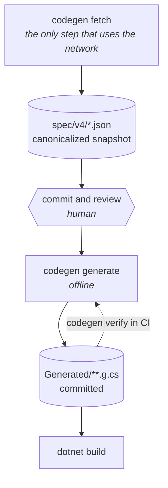
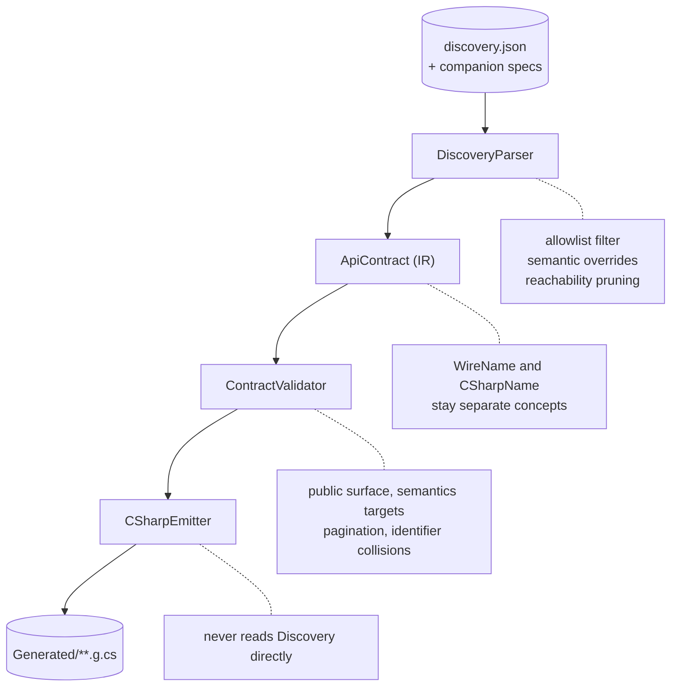
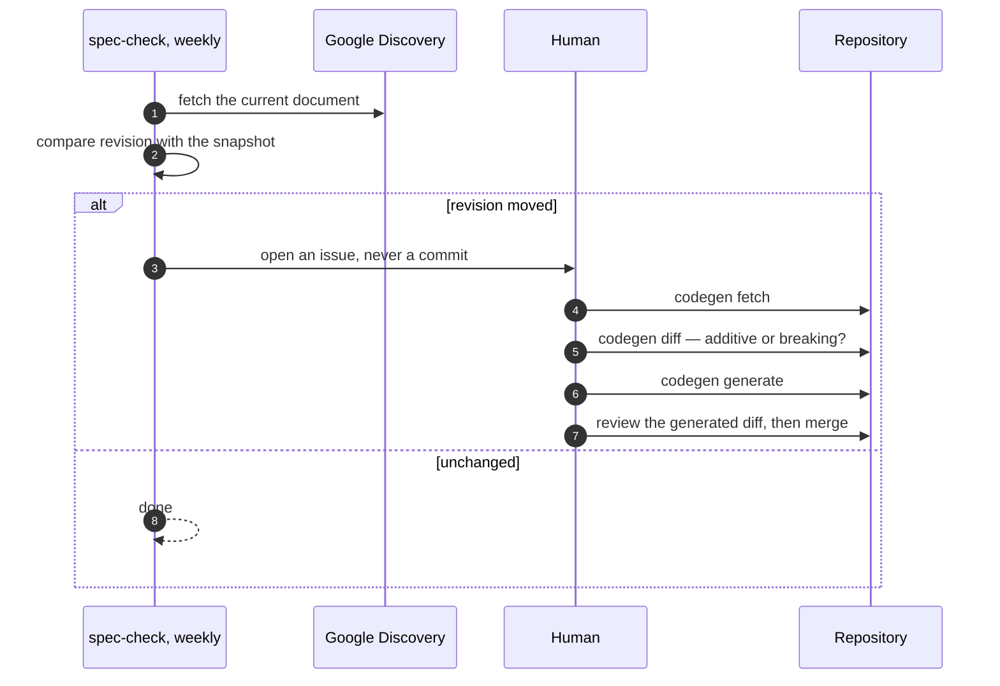

# Code generation

How the Google Health API contract becomes C#.



Generation never runs during a build ([ADR-0003](adr/0003-discovery-driven-deterministic-generation.md)).
The generator itself is offline: `codegen generate` and `codegen verify` read the committed
snapshot and nothing else. A `dotnet build` still restores packages unless you pass
`--no-restore`, which is NuGet rather than this generator, and is the only network a build has.

## Specification inputs

All committed, all reviewable:

| File | Role |
|---|---|
| `spec/versions.json` | Which contract versions exist and which one is current |
| `spec/v4/discovery.json` | Google's snapshot, stored canonicalized. Never hand-edited |
| `spec/v4/metadata.json` | Provenance: revision, source URL, SHA-256, byte length |
| `spec/v4/public-surface.json` | Allowlist of publicly exposed operations, plus explicit exclusions |
| `spec/v4/semantics.json` | Behaviour Discovery cannot express, with provenance per entry |
| `spec/v4/data-types.json` | Per-data-type capabilities, which Discovery does not encode |
| `spec/v4/errors.json` | Known error reasons, which Discovery does not contain |

`discovery.json` is Google's, and so is the content of `data-types.json` and `errors.json` —
those two are normalized from Google's published pages, which is why `NOTICE` attributes them.
What is decided here is the shape they are stored in, plus `public-surface.json` and
`semantics.json`, which are judgements outright. `versions.json` and `metadata.json` record facts.
The four that carry a judgement carry a `$comment` saying what it is.

## The snapshot is canonicalized

The Discovery endpoint returns the same document with **randomized object key order on every
request**. Four consecutive fetches on 2026-08-09 produced four different SHA-256 values at an
identical byte length with no semantic difference.

`codegen fetch` therefore stores a canonical form: keys sorted ordinally, two-space indent, LF,
UTF-8 without BOM, trailing newline. Array order, numbers and strings are untouched. This is what
makes the recorded hash meaningful and keeps a contract update readable as a diff. `SpecLoader`
refuses to run against a non-canonical snapshot.

Canonicalizing is not hand-editing: it is deterministic, lossless, and applied by the tool.

## Pipeline



Current output for `v4`: **237 committed files** covering 25 operations of 27, all 138 reachable
schemas of 147, 58 open enums, 19 scopes and 58 error reasons.

## Commands

```bash
codegen fetch    --version v4   # refresh snapshot + metadata (network)
codegen diff     --version v4   # classify changes as additive or potentially breaking
codegen generate --version v4   # emit C# from the committed snapshot (offline)
codegen verify   --version v4   # fail if the checked-in sources are stale or orphaned
```

## Determinism, and how it is verified

The same specification must produce byte-identical C# on every machine, so the emitter is barred
from observing anything that varies: no timestamp, no machine path, no culture-sensitive
formatting, no unordered enumeration.

| Guard | What it catches |
|---|---|
| `codegen verify` in CI, on Linux and Windows | A hand-edited generated file, or a stale checkout |
| The pipeline run twice in one process | Dependence on dictionary enumeration order |
| Provenance-header scan | A clock or a machine path leaking into output |
| LF and no-BOM assertions | A platform-dependent byte difference |
| `.gitattributes` pinning `spec/**/*.json` to `-text` | `core.autocrlf` rewriting the snapshot |

Every generated file records what it came from, and nothing about when or where it was generated:

```text
// <auto-generated />
// Google Health API contract generated by Kkdev92.HealthData.CodeGen.
// API version: v4
// Discovery revision: 20260826
// Spec SHA-256: a333ed417b30f5d9b0fe922807eb8f7e3ea0eec809f06c2f14f03e53129bec40
```

## Path template escaping

Google specifies both variable forms in `google/api/http.proto`:

| Form | Rule |
|---|---|
| `{var}` (single segment) | percent-encode everything except `[-_.~0-9a-zA-Z]` |
| `{+var}` (multi segment) | percent-encode everything except `[-_.~/0-9a-zA-Z]` |

The multi-segment form deliberately does **not** follow RFC 6570 reserved expansion, because
reserved expansion leaves `?` and `#` intact "which would lead to invalid URLs".

Google's official .NET client skips escaping entirely for `{+var}`, so a resource id containing a
reserved character produces a malformed request. This SDK follows the specification instead and
pins the behaviour in `UriTemplateTests`.

`Uri.EscapeDataString` preserves exactly `-._~0-9A-Za-z`, which is the single-segment rule
verbatim, so it is the primitive used for both forms.

## Why a CLI and not a source generator

A Roslyn source generator would have to read the Discovery document during the build. That makes
the build non-hermetic, hides the emitted code from review, and moves contract changes outside the
pull request. An explicit CLI keeps generation a reviewed action and the output a committed
artifact a diff can show.

## Refreshing the contract



A bot does not push to `main`. What a contract change means for the package version is in
[compatibility.md](compatibility.md).
