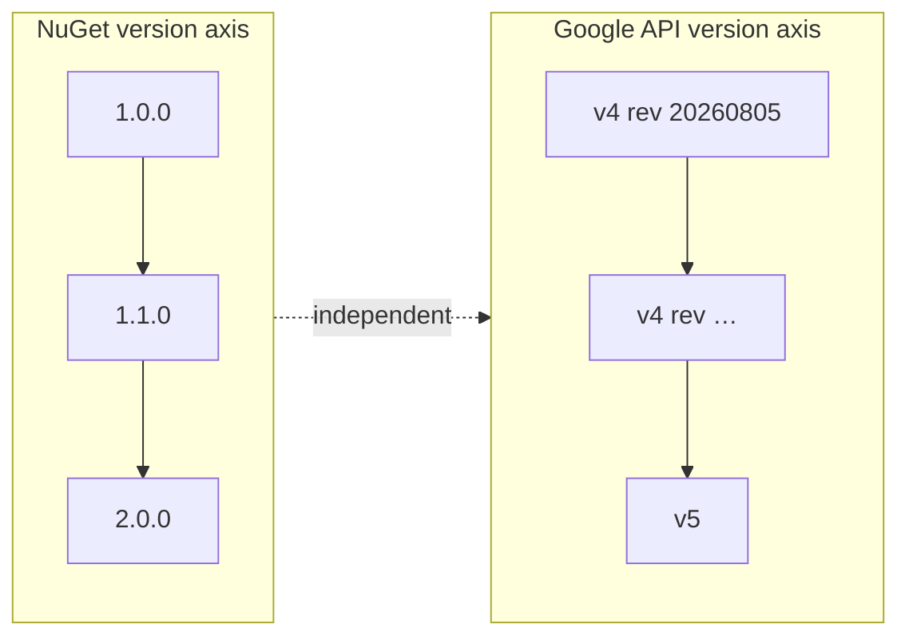

# Compatibility and versioning

The Google Health API version and the NuGet package version are independent axes
([ADR-0004](adr/0004-version-neutral-package-identity.md)).



A new Google Health API major version does **not** by itself cause a NuGet major bump. Only a
breaking change to this SDK's public API does. The package is not named after `v4`, and the
runtime does not special-case it: the versioned path segment belongs to the generated contract.

## What bumps what

| Change | Bump |
|---|---|
| Bug fix, serialization fix, diagnostics fix | Patch |
| New endpoint, new model, new optional field, new known enum value, new helper | Minor |
| Method removal or rename, parameter type change, incompatible model redesign, auth abstraction break | Major |

Additive changes stay additive because of two deliberate design choices:

- **Open enums.** A value Google adds later is preserved verbatim instead of failing to
  deserialize ([ADR-0005](adr/0005-open-enums.md)), so a new enum value is a minor release, not a
  breaking one.
- **Unknown properties are ignored.** A new field on a response does not break an existing
  consumer.

## How a change is caught

Five independent signals, because each catches something the others miss:

| Signal | Catches |
|---|---|
| `codegen diff` | The Google contract moved: operations, parameters, schemas, enum values, scopes |
| Generated C# diff in the pull request | What that actually did to the emitted code |
| Approved public API snapshot (`tests/PublicApi`) | A type or member that appears, disappears or is renamed, generated or handwritten |
| Packaged consumer build (`PackagedConsumerTests`) | A package that restores but cannot actually be used: missing dependency, wrong `lib` folder, four packages that will not install together |
| Package validation | Binary breaking changes against the published baseline |

To approve a deliberate API change:

```bash
APPROVE_PUBLIC_API=1 dotnet test --filter PublicApi
git diff tests/PublicApi   # review this carefully before committing
```

### What the API snapshot does not catch

It records names and shapes. It does **not** record sealed-ness, nullability, `init` as against
`set`, base types and interfaces, generic constraints, enum and constant values, or operators — a
change to any of those passes with no diff. So "the snapshot is unchanged" means the names and
signatures are unchanged, and nothing stronger. It is a cheap first signal, not a compatibility
proof.

Package validation is the signal that checks binary compatibility directly, and it needs a
published version to compare against. `PackageValidationBaselineVersion` in
`src/Directory.Build.props` names it, `dotnet pack` downloads that package from nuget.org, and
the assemblies are compared against it. Removing a public member fails the pack:

```text
error CP0002: 'double? Kkdev92.HealthData.ActiveEnergyBurned.Kcal.get' exists on the
              [baseline] lib/net10.0/Kkdev92.HealthData.dll but not on
              lib/net10.0/Kkdev92.HealthData.dll
```

**Raise the baseline to the version just published, on every release.** Left behind, it compares
against an increasingly old package, and a break introduced after the baseline stops being
visible. The release workflow does not enforce this, because the value has to change in the same
commit that raises the version, and only a person knows which release is which.

**The baseline is deliberately absent while the alpha surface is being reshaped.** The first real
consumer's feedback moved namespaces, enum placement and resource-name types, and each of those is
an intentional binary break the validator would refuse. Suppressing hundreds of expected CP0002s
would normalise pasting suppressions, which costs more than one release without the check. The
property comes back, pointed at the next published version, in the pull request that publishes it
— and until then the API snapshot above is the only signal watching the surface.

A deliberate break is recorded rather than argued with: rebuild with
`/p:ApiCompatGenerateSuppressionFile=true` to write a suppression file, and the suppression is
then a reviewable file in the diff.

None of the five is a proof on its own, and package validation is not either — it compares
assemblies, not behaviour. They are five different ways of noticing, and the reason there are five
is that each misses what the others catch.

## How the four packages are versioned together

They ship in lockstep: one version number, one release, all four or none. The generated contract
sits in the core package and the other three are built against it, so a release where they disagree
is a release nobody has tested.

What the packages *declare* is looser than that, deliberately. Each satellite depends on
`Kkdev92.HealthData` at the version it shipped with, which NuGet reads as a minimum rather than an
exact pin — so a consumer who takes a newer core gets it, and a diamond with another package that
wants a newer core resolves instead of failing. An exact pin would turn every such diamond into an
error the consumer cannot fix.

That trade only holds while this SDK keeps SemVer, which is the promise the table above is. If a
core release ever breaks a satellite, the fault is the version number, not the range.

## Semantic risk a diff cannot show

Some changes never appear in a Discovery diff:

- retry guidance
- page size policy
- date-range limits
- webhook behaviour
- OAuth behaviour

For those, read the release notes. `semantics.json` is where the resulting decision is recorded,
with provenance, so the next reader knows why the SDK behaves the way it does.

## Known documentation conflicts

Where Google's own documents disagree, the conflict is recorded rather than silently resolved, and
each resolution is pinned by a test. The canonical list is in
[architecture.md](architecture.md#known-documentation-conflicts).

## Upgrading across a Google API version

If Google publishes v5, the package stays `Kkdev92.HealthData`. The steps are: add `spec/v5`,
snapshot it, generate its IR, diff v4 against v5, assess the public API impact, record an ADR,
and only then switch the current contract. The NuGet
major version moves only if this SDK's public API breaks.
