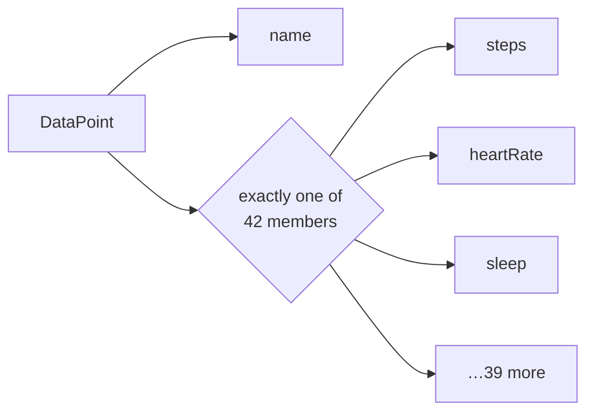

# Data points

A data point is one health measurement. Everything under `users/{user}/dataTypes/{dataType}` reads
and writes them, and it is the part of the API with the most shape to it.

```text
users/me/dataTypes/heart-rate/dataPoints/1234
└──┬──┘            └────┬───┘            └─┬┘
  user          data type id           data point
                 kebab-case
```

The data type is chosen through the resource name, not through a separate parameter. That is why
`client.Users.DataPoints` has no `dataTypes` level in C#: `dataTypes` declares no methods of its
own, so it is flattened away.

## One type, one measurement

`DataPoint` is a **union**: exactly one of its **42 measurement members** is set, and the other
41 are null.

Discovery does not say that. It models the type as a single message with 43 optional message-typed
properties and no way to express "one of". The forty-third is `dataSource`, which is not one of the
alternatives at all — it says where a point came from rather than what was measured, and every
point carries it alongside whichever measurement it holds. It stays a normal property; only the
union helpers leave it out. `spec/v4/semantics.json` records that decision with Google's own
wording for why, and it matters: counted as a member, it sorts first and `GetKind()` answers
`DataSource` for every real measurement.



Reading this by testing 42 properties for null is not reasonable, so two helpers are generated:

```csharp
switch (point.GetKind())
{
    case DataPointKind.Steps:
        Console.WriteLine(point.Steps!.Count);
        break;

    case DataPointKind.HeartRate:
        Console.WriteLine(point.HeartRate!.BeatsPerMinute);
        break;

    case DataPointKind.Unknown:
        // A member added to the API after this contract was generated. The payload round-trips
        // intact; there is simply no typed accessor for it yet.
        break;

    case DataPointKind.None:
        // No measurement member was set at all.
        break;
}
```

`GetValue()` returns the set member as `object?` when you only need to know *that* there is one —
logging its type, counting kinds, routing to a handler.

| | `DataPointKind` | `RollupDataPointKind` |
|---|---|---|
| Measurement members | 42 | 21 |
| Plus | `None`, `Unknown` | `None`, `Unknown` |

`Unknown` is what makes this forward-compatible. A member Google adds later deserializes,
round-trips and reports `Unknown` instead of throwing — the same reasoning as
[ADR-0005](adr/0005-open-enums.md) applied to a union rather than an enum.

The helpers are generated from the contract, so a new member appears in both the enum and the
switch surface the next time the snapshot is refreshed.

## Time comes in three parts

A measurement is timed one of two ways, depending on whether it is a span or a reading:

| Shape | Used by | Member |
|---|---|---|
| `ObservationTimeInterval` | 13 measurements that cover a span, such as steps | `Interval` |
| `ObservationSampleTime` | 14 measurements that are a single reading, such as heart rate | `SampleTime` |
| `SessionTimeInterval` | 6 session-shaped measurements, such as exercise | `Interval` |

Whichever shape applies, the same instant is recorded **three ways**, and dropping any of the
three loses information:

| Concept | Interval fields | Sample fields | Type |
|---|---|---|---|
| The physical instant, always UTC | `StartTime` / `EndTime` | `PhysicalTime` | `GoogleTimestamp` |
| The offset in force where the user was | `StartUtcOffset` / `EndUtcOffset` | `UtcOffset` | `GoogleDuration` |
| The wall-clock reading the user saw | `CivilStartTime` / `CivilEndTime` | `CivilTime` | `CivilDateTime` |

Use the physical instant to order or compare events. Use the civil time to say "you slept at
23:40" — a run at 07:00 local is a morning run whether the user was in Tokyo or Lisbon.

`CivilDateTime` and `Date` are ordinary generated models, not primitives: Discovery declares them
as message schemas ([ADR-0008](adr/0008-explicit-google-wire-primitives.md)).

No helper fuses the instant and the offset, because the two are independently optional. Combine
them explicitly when you need a local `DateTimeOffset`:

```csharp
var sample = point.HeartRate!.SampleTime!;

if (sample.PhysicalTime is { } instant && sample.UtcOffset is { } offset)
{
    var local = instant.ToDateTimeOffset().ToOffset(offset.ToTimeSpan());
}
```

## Reading

```csharp
await foreach (var point in client.Users.DataPoints.EnumerateAsync(
    new ListDataPointsRequest
    {
        Parent = UserName.Me.DataType("steps"),
        Filter = "steps.interval.start_time >= \"2026-08-01T00:00:00Z\" "
               + "AND steps.interval.start_time < \"2026-08-08T00:00:00Z\"",   // steps is interval-shaped
    },
    cancellationToken))
{
    // one page in memory at a time
}
```

### The filter field depends on the time shape

The filter is an [AIP-160](https://google.aip.dev/160) expression, and **the field you filter on
is determined by how the data type is timed** — the same split as the section above. Using the
interval form on a sample-shaped type does not work.

| Data type shape | Field | Operators | Literal |
|---|---|---|---|
| Interval | `{type}.interval.start_time` | `>=` `<` | RFC 3339 |
| Interval, wall clock | `{type}.interval.civil_start_time` | `>=` `<` | `YYYY-MM-DD[THH:mm:ss]` |
| Sample | `{type}.sample_time.physical_time` | `>=` `<` | RFC 3339 |
| Sample, wall clock | `{type}.sample_time.civil_time` | `>=` `<` | `YYYY-MM-DD[THH:mm:ss]` |
| Daily summary | `{type}.date` | `>=` `<` | `YYYY-MM-DD` |
| Session, wall clock | `{type}.interval.civil_start_time` | `>=` `<` | `YYYY-MM-DD[THH:mm:ss]` |

Three types are special-cased by Google:

| Type | Rule |
|---|---|
| `electrocardiogram` | Only `interval.start_time`, only `>=`. End time is not filterable |
| `sleep` | Filtered on the **end** of the session: `sleep.interval.end_time` or `.civil_end_time` |
| `sleep` | The only type where `OR` is accepted. Everywhere else the sole logical operator is `AND` |

**The prefix is the type's `filterName`, which is snake_case — not the kebab-case id used in the
resource name.** They differ whenever the name has more than one word:

```csharp
Parent = UserName.Me.DataType("heart-rate"),          // kebab-case, in the resource name
Filter = "heart_rate.sample_time.physical_time >= \"2026-08-01T00:00:00Z\"",   // snake_case
```

Neither spelling is derived from the other, and the SDK reshapes neither. `data-types.json`
records both per type for exactly this reason.

Results come back **ordered by interval start time, descending**.

`ReconcileAsync` returns `ReconciledDataPoint` values — the merged view across sources. It is a
**GET** with no side effects despite the `:reconcile` verb, and it accepts any one of all thirteen
read and write scopes, because it reconciles across all of them.

## Writing

`CreateAsync`, `PatchAsync` and `BatchDeleteAsync` return an `Operation`, not the written value.
See [runtime.md](runtime.md#long-running-operations) for what to do with one.

Server-owned fields are stripped from the request automatically, so a value you read back and
write again does not get rejected for echoing something the service owns
([ADR-0006](adr/0006-write-contract-excludes-read-only-fields.md)).

Note that `dataPoints.patch` has **no** `updateMask` parameter, unlike every other patch in this
API. That is Google's contract, verified against Discovery, not an omission here.

## Roll-ups

| Method | Aggregates | Pagination |
|---|---|---|
| `RollUpAsync` | Over a requested interval | Page size and token travel **in the request body** |
| `DailyRollUpAsync` | Per calendar day | Request accepts a page token; the response returns none |

Both are `POST` but neither writes anything, so both are classified `SemanticallySafe` and are
retried when retry is enabled. Neither gets an `EnumerateAsync` helper: `RollUp` paginates through
the body rather than the query, and `DailyRollUp` gives you no cursor to follow.

Roll-up results are `RollupDataPoint`, a second union with its own `GetKind()` and 21 measurement
members — a smaller set, because not every measurement aggregates.

**`RollUp` and `Rollup` are both correct, and the difference is not a typo here.** Discovery spells
the methods `rollUp` and `dailyRollUp`, and the schemas `RollupDataPoint` and
`DailyRollupDataPoint`. The generator reproduces each as it is given, so `RollUpAsync` returns a
`RollupDataPoint`. Normalising one to match the other would mean this SDK's names no longer matched
the contract they came from, which is the one thing the generator will not do.

## The data type catalogue

`spec/v4/data-types.json` records all 43 data types with the operations each supports. The
information is not in Discovery: the REST path is the generic `dataTypes/{dataTypesId}`, so
per-type capability exists only in Google's prose documentation. The file is maintained by hand
under review; the build never scrapes HTML.

Capability is not uniform:

| Supported operations | Data types |
|---|---|
| `list`, `reconcile` | 12 |
| `list`, `reconcile`, `rollUp`, `dailyRollUp` | 11 |
| Everything, including `create` / `patch` / `batchDelete` | 4 |
| Write-only: `create`, `patch`, `batchDelete` | 4 |
| `list`, `get`, `reconcile`, `create`, `patch`, `batchDelete` | 3 |
| Other combinations | 9 |

Two mismatches are worth knowing, both real rather than bookkeeping errors:

- `basal-energy-burned` and `data-source` are `DataPoint` members but are not listed as data types.
- `calories-in-heart-rate-zone` and `total-calories` are data types that appear only in roll-ups,
  never as a `DataPoint` member.

Capabilities are published as **metadata, not validation**. The SDK does not reject a call because
this file says a type has no `create`; the server remains the authority. Two fields are
deliberately absent rather than guessed: per-type record kind, and per-type webhook support, which
Google's Data Types page does not state.

## Exporting a workout

`ExportExerciseTcxAsync` is dual-natured. It returns JSON, or the TCX document itself when the
request asks for media, so both overloads are generated:

```csharp
// as a model
var response = await client.Users.DataPoints.ExportExerciseTcxAsync(request, cancellationToken);

// as the raw TCX stream
await using var file = File.Create("workout.tcx");
await client.Users.DataPoints.ExportExerciseTcxAsync(request, file, cancellationToken);
```

The stream overload never buffers the whole document. A TCX export is a health record; treat it
the way you would treat the measurements themselves.
