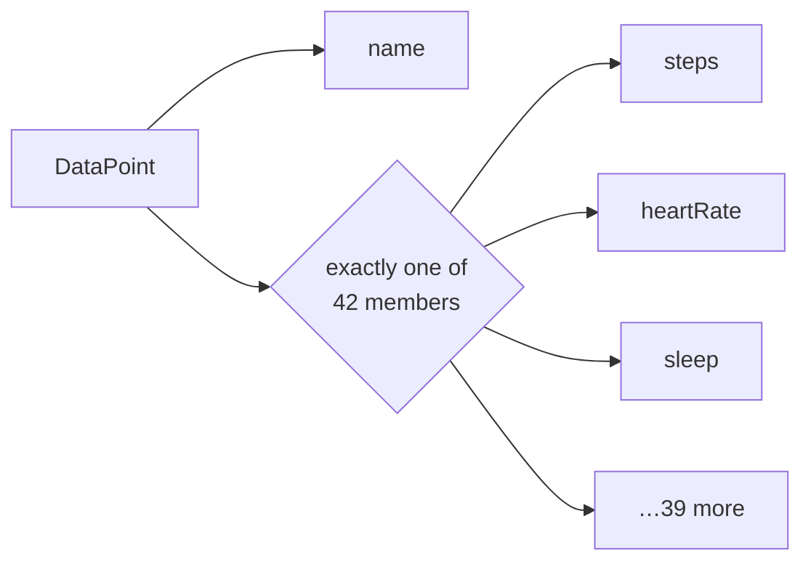

# Data points

A data point is one health measurement. Everything under `users/{user}/dataTypes/{dataType}` reads
and writes them, and it is the part of the API with the most shape to it.

```text
users/me/dataTypes/heart-rate/dataPoints/1234
└──┬──┘            └────┬───┘            └─┬┘
  user          data type id           data point
                 kebab-case
```

The data type is chosen through the resource name, not through a separate parameter. That is why
`client.Users.DataPoints` has no `dataTypes` level in C#: `dataTypes` declares no methods of its
own, so it is flattened away.

## Use `UserName.Me` for a parent, even when you have a name from the service

A name that comes back from the service carries the numeric user id, not `me`:

```text
users/1234567890123456789/dataTypes/hydration-log/dataPoints/9876543210
```

`DataPointName.Parse` accepts it, and sending it back where a **name** is expected works —
`GetAsync`, `PatchAsync`, `ExportExerciseTcxAsync`. Sending it back where a **parent** is expected
mostly does not:

| Operation | `users/me` | `users/{id}` |
|---|---|---|
| `ListAsync` | works | **refused** |
| `ReconcileAsync` | works | **refused** |
| `RollUpAsync` | works | **refused** |
| `DailyRollUpAsync` | works | **refused** |
| `BatchDeleteAsync` | works | **refused** |
| `CreateAsync` | works | works |
| `PairedDevices.ListAsync` | works | works |

So this is the shape that fails:

```csharp
var name = DataPointName.Parse(point.Name!);

// 400 INVALID_ARGUMENT — the parent carries the numeric user id
await client.Users.DataPoints.ListAsync(new ListDataPointsRequest { Parent = name.DataType });
```

and this is the shape that works:

```csharp
await client.Users.DataPoints.ListAsync(
    new ListDataPointsRequest { Parent = UserName.Me.DataType(name.DataTypeId) });
```

Only the parent needs rebuilding. A name inside a request **body** is fine as it arrived —
`BatchDeleteAsync` accepts a numeric id in `Names` as long as `Parent` says `me`.

The rule is not one you can derive. `list` and `create` are the same path and disagree;
`pairedDevices.list` has the same shape and is accepted; it is not reads against writes, and it is
not the URL template. It is not stated in Discovery either, so the generator cannot know it and no
type here encodes it. The sharp end is that `list` returns the names that `list` will not take
back.

The refusal is `400 INVALID_ARGUMENT`, `"Request contains an invalid argument."`, with **no**
`details` — so `HealthDataApiException.Error.Details` is empty and `Reason` falls back to the
canonical status. There is nothing for this SDK to surface, which is why it is written down here
instead.

This SDK does not rewrite the segment for you. It cannot: `users/{id}` is the correct form when a
subscription names a user other than the caller, and silently turning it into `me` would break that
while fixing this.

## One type, one measurement

`DataPoint` is a **union**: exactly one of its **42 measurement members** is set, and the other
41 are null.

Discovery does not say that. It models the type as a single message with 43 optional message-typed
properties and no way to express "one of". The forty-third is `dataSource`, which is not one of the
alternatives at all — it says where a point came from rather than what was measured, and every
point carries it alongside whichever measurement it holds. It stays a normal property; only the
union helpers leave it out. `spec/v4/semantics.json` records that decision with Google's own
wording for why, and it matters: counted as a member, it sorts first and `GetKind()` answers
`DataSource` for every real measurement.

**Setting two is refused when the request is written.** Nothing in the type system stops it — the
members are ordinary properties, and they have to stay settable because `dataPoints.patch` is read,
modify, send — so the check runs where the body is serialized, which is the last point at which the
object is finished and nothing has left yet. The message names both members:

```text
System.InvalidOperationException: A DataPoint carries one measurement, and this one has 2:
steps, weight. The service accepts exactly one, so this request would be refused.
```

Reading is unaffected. A response carrying two still deserializes: refusing it would drop a
person's data over a client-side rule about a shape the service chose to send.



Reading this by testing 42 properties for null is not reasonable, so two helpers are generated:

```csharp
switch (point.GetKind())
{
    case DataPointKind.Steps:
        Console.WriteLine(point.Steps!.Count);
        break;

    case DataPointKind.HeartRate:
        Console.WriteLine(point.HeartRate!.BeatsPerMinute);
        break;

    case DataPointKind.Unknown:
        // A member added to the API after this contract was generated. The payload round-trips
        // intact; there is simply no typed accessor for it yet.
        break;

    case DataPointKind.None:
        // No measurement member was set at all.
        break;
}
```

`GetValue()` returns the set member as `object?` when you only need to know *that* there is one —
logging its type, counting kinds, routing to a handler.

| | `DataPointKind` | `RollupDataPointKind` |
|---|---|---|
| Measurement members | 42 | 21 |
| Plus | `None`, `Unknown` | `None`, `Unknown` |

`Unknown` is what makes this forward-compatible. A member Google adds later deserializes,
round-trips and reports `Unknown` instead of throwing — the same reasoning as
[ADR-0005](adr/0005-open-enums.md) applied to a union rather than an enum.

The helpers are generated from the contract, so a new member appears in both the enum and the
switch surface the next time the snapshot is refreshed.

## Points arrive per source, so adding them up double-counts

A person can have more than one thing recording the same measurement — a wrist device and a
phone, say. Each reports its own points, so `list` returns the same walk twice, once per source.
Sum them and the total is inflated. Nothing in the response says so: every point is genuine, and
the count is only wrong once you treat the set as one person's day.

**Filtering by `Platform` does not separate them.** A phone's built-in tracking and a wrist
device from the same vendor report the same platform. `DataSource` carries `Platform`,
`RecordingMethod`, `Application` and `Device`, and it is `Device.DisplayName` that tells two
devices apart.

**Use a roll-up for the figure.** `RollUpAsync` and `DailyRollUpAsync` aggregate across sources
and answer with one number for the person. Reach for `list` when the question is *which device*,
not *how much*.

`ReconcileAsync` also answers across sources, and it does so by resolving them: the value is the
merged one. What it cannot tell you is where that value came from — a `ReconciledDataPoint`
carries no `dataSource`, because after merging there is no single source to name. It also calls
the point `DataPointName` rather than `Name`.

| You want | Use | Attribution |
|---|---|---|
| One number for the person | `RollUpAsync`, `DailyRollUpAsync` | — |
| One number, reconciled point by point | `ReconcileAsync` | dropped |
| Which device recorded what | `ListAsync` | `DataSource.Device` |

## Time comes in three parts

A measurement is timed one of two ways, depending on whether it is a span or a reading:

| Shape | Used by | Member |
|---|---|---|
| `ObservationTimeInterval` | 13 measurements that cover a span, such as steps | `Interval` |
| `ObservationSampleTime` | 14 measurements that are a single reading, such as heart rate | `SampleTime` |
| `SessionTimeInterval` | 6 session-shaped measurements, such as exercise | `Interval` |

Whichever shape applies, the same instant is recorded **three ways**, and dropping any of the
three loses information:

| Concept | Interval fields | Sample fields | Type |
|---|---|---|---|
| The physical instant, always UTC | `StartTime` / `EndTime` | `PhysicalTime` | `GoogleTimestamp` |
| The offset in force where the user was | `StartUtcOffset` / `EndUtcOffset` | `UtcOffset` | `GoogleDuration` |
| The wall-clock reading the user saw | `CivilStartTime` / `CivilEndTime` | `CivilTime` | `CivilDateTime` |

Use the physical instant to order or compare events. Use the civil time to say "you slept at
23:40" — a run at 07:00 local is a morning run whether the user was in Tokyo or Lisbon.

`CivilDateTime` and `Date` are ordinary generated models, not primitives: Discovery declares them
as message schemas ([ADR-0008](adr/0008-explicit-google-wire-primitives.md)).

No helper fuses the instant and the offset, because the two are independently optional. Combine
them explicitly when you need a local `DateTimeOffset`:

```csharp
var sample = point.HeartRate!.SampleTime!;

if (sample.PhysicalTime is { } instant && sample.UtcOffset is { } offset)
{
    var local = instant.ToDateTimeOffset().ToOffset(offset.ToTimeSpan());
}
```

## Reading

```csharp
await foreach (var point in client.Users.DataPoints.EnumerateAsync(
    new ListDataPointsRequest
    {
        Parent = UserName.Me.DataType("steps"),
        Filter = "steps.interval.start_time >= \"2026-08-01T00:00:00Z\" "
               + "AND steps.interval.start_time < \"2026-08-08T00:00:00Z\"",   // steps is interval-shaped
    },
    cancellationToken))
{
    // one page in memory at a time
}
```

> **An enumeration that finishes is not the same as an enumeration that was complete.** The service
> drops records that share a timestamp with the last record of a page, with no error and no
> duplicate to show for it. Types whose entries are all stamped at the same instant each day —
> `hydration-log` among them — are the ones this bites hardest; a type recorded through the day,
> like `steps`, is less exposed rather than immune. Why this SDK cannot repair it is in
> [operations.md](operations.md#following-the-cursor-can-return-fewer-records-than-exist).

### The filter field depends on the time shape

The filter is an [AIP-160](https://google.aip.dev/160) expression, and **the field you filter on
is determined by how the data type is timed** — the same split as the section above. Using the
interval form on a sample-shaped type does not work.

| Data type shape | Field | Operators | Literal |
|---|---|---|---|
| Interval | `{type}.interval.start_time` | `>=` `<` | RFC 3339 |
| Interval, wall clock | `{type}.interval.civil_start_time` | `>=` `<` | `YYYY-MM-DD[THH:mm:ss]` |
| Sample | `{type}.sample_time.physical_time` | `>=` `<` | RFC 3339 |
| Sample, wall clock | `{type}.sample_time.civil_time` | `>=` `<` | `YYYY-MM-DD[THH:mm:ss]` |
| Daily summary | `{type}.date` | `>=` `<` | `YYYY-MM-DD` |
| Session, wall clock | `{type}.interval.civil_start_time` | `>=` `<` | `YYYY-MM-DD[THH:mm:ss]` |

Three types are special-cased by Google:

| Type | Rule |
|---|---|
| `electrocardiogram` | Only `interval.start_time`, only `>=`. End time is not filterable |
| `sleep` | Filtered on the **end** of the session: `sleep.interval.end_time` or `.civil_end_time` |
| `sleep` | The only type where `OR` is accepted. Everywhere else the sole logical operator is `AND` |

**The prefix is the type's `filterName`, which is snake_case — not the kebab-case id used in the
resource name.** They differ whenever the name has more than one word:

```csharp
Parent = UserName.Me.DataType("heart-rate"),          // kebab-case, in the resource name
Filter = "heart_rate.sample_time.physical_time >= \"2026-08-01T00:00:00Z\"",   // snake_case
```

Neither spelling is derived from the other, and the SDK reshapes neither. `data-types.json`
records both per type for exactly this reason.

Results come back **ordered by interval start time, descending**.

`ReconcileAsync` returns `ReconciledDataPoint` values — the merged view across sources. It is a
**GET** with no side effects despite the `:reconcile` verb, and it accepts any one of all thirteen
read and write scopes, because it reconciles across all of them.

## Writing

`CreateAsync`, `PatchAsync` and `BatchDeleteAsync` return an `Operation`, not the written value.
See [runtime.md](runtime.md#long-running-operations) for what to do with one.

Server-owned fields are stripped from the request automatically, so a value you read back and
write again does not get rejected for echoing something the service owns
([ADR-0006](adr/0006-write-contract-excludes-read-only-fields.md)).

Note that `dataPoints.patch` has **no** `updateMask` parameter, unlike every other patch in this
API. That is Google's contract, verified against Discovery, not an omission here.

## Roll-ups

| Method | Aggregates | Pagination |
|---|---|---|
| `RollUpAsync` | Over a requested interval | Page size and token travel **in the request body** |
| `DailyRollUpAsync` | Per calendar day | Request accepts a page token; the response returns none |

Both are `POST` but neither writes anything, so both are classified `SemanticallySafe` and are
retried when retry is enabled.

`RollUp` has an `EnumerateAsync` helper like every other paged operation. Where the cursor travels
is a detail of the request — its body carries a `WithPageToken` copy, generated from the same
declaration — and what decides whether enumeration is possible is the response, which returns a
next page token.

`DailyRollUp` is the one operation without one, and not by preference: it accepts a page token and
its response returns none, so there is nothing to follow. The generated model says so on the
property itself.

Roll-up results are `RollupDataPoint`, a second union with its own `GetKind()` and 21 measurement
members — a smaller set, because not every measurement aggregates.

### `PageSize` on a roll-up is a constraint on duration, not a page size

Leave it unset. Every roll-up tested returns all of its windows in one response whether it is set
or not, and setting it only adds ways to be refused.

Both requests carry the property because Discovery declares it, and its description — the maximum
number of points, 1440 by default, 10000 truncated — is Google's own wording, reproduced as given.
Observed behaviour differs: a request that returns 1,686 points returns the same 1,686 with
`PageSize` set to 1440. It does not cap the result.

What it does do is get multiplied by the window and checked against the range cap for the data
type. The check ignores the range you asked for, so a one-day request is refused just the same:

```csharp
// steps caps at 90 days. 2161 hours is 90 days and an hour, so this is refused
// even though the range is one day.
Range = OneDay, WindowSize = OneHour, PageSize = 2161   // INVALID_ROLLUP_QUERY_DURATION
```

The error names the duration, and the duration is fine — the offending field is `PageSize`.

`DailyRollUp` adds a floor: `PageSize` must also be at least the number of windows the range
covers. Below that it is refused as `INVALID_DATA_POINT_NAME`, which likewise names something
that is not wrong. Over ninety days of daily windows, the only accepted value is exactly 90.
`RollUp` has no floor.

**`RollUp` and `Rollup` are both correct, and the difference is not a typo here.** Discovery spells
the methods `rollUp` and `dailyRollUp`, and the schemas `RollupDataPoint` and
`DailyRollupDataPoint`. The generator reproduces each as it is given, so `RollUpAsync` returns a
`RollupDataPoint`. Normalising one to match the other would mean this SDK's names no longer matched
the contract they came from, which is the one thing the generator will not do.

## The data type catalogue

`spec/v4/data-types.json` records all 43 data types with the operations each supports. The
information is not in Discovery: the REST path is the generic `dataTypes/{dataTypesId}`, so
per-type capability exists only in Google's prose documentation. The file is maintained by hand
under review; the build never scrapes HTML.

Capability is not uniform:

| Supported operations | Data types |
|---|---|
| `list`, `reconcile` | 12 |
| `list`, `reconcile`, `rollUp`, `dailyRollUp` | 11 |
| Everything, including `create` / `patch` / `batchDelete` | 4 |
| Write-only: `create`, `patch`, `batchDelete` | 4 |
| `list`, `get`, `reconcile`, `create`, `patch`, `batchDelete` | 3 |
| Other combinations | 9 |

Two mismatches are worth knowing, both real rather than bookkeeping errors:

- `basal-energy-burned` and `data-source` are `DataPoint` members but are not listed as data types.
- `calories-in-heart-rate-zone` and `total-calories` are data types that appear only in roll-ups,
  never as a `DataPoint` member.

The table ships. `HealthDataGeneratedDataTypes` is generated from that file, so an application does
not have to copy it — which is what the first one built on this SDK did, with a comment saying
there was nowhere else to get it:

```csharp
var steps = HealthDataGeneratedDataTypes.Find("steps");

steps.Supports("dailyRollUp");   // true
steps.Supports("get");           // false - this is the 400 UNSUPPORTED_DATA_TYPE_ACTION
steps.FilterName;                // "steps"
```

Capabilities are published as **metadata, not validation**. The SDK does not reject a call because
this file says a type has no `create`; the server remains the authority, and `Find` returning null
for a type Google added after this capture means "not in the table", not "not supported". Two
fields are deliberately absent rather than guessed: per-type record kind, and per-type webhook
support, which Google's Data Types page does not state.

`FilterName` is the prefix a filter is written against and **not a filter**. `heart-rate` filters on
`heart_rate.sample_time.physical_time` while `steps` filters on `steps.interval.start_time`, and
`sleep`, `exercise` and `hydration-log` reject the interval member the others accept — measured
against the live service, not inferred. Composing an expression from the prefix produces a 400 that
looks like the SDK's own answer.

## Exporting a workout

`ExportExerciseTcxAsync` is dual-natured. It returns JSON, or the TCX document itself when the
request asks for media, so both overloads are generated:

```csharp
// as a model
var response = await client.Users.DataPoints.ExportExerciseTcxAsync(request, cancellationToken);

// as the raw TCX stream
await using var file = File.Create("workout.tcx");
await client.Users.DataPoints.ExportExerciseTcxAsync(request, file, cancellationToken);
```

The stream overload never buffers the whole document. A TCX export is a health record; treat it
the way you would treat the measurements themselves.
