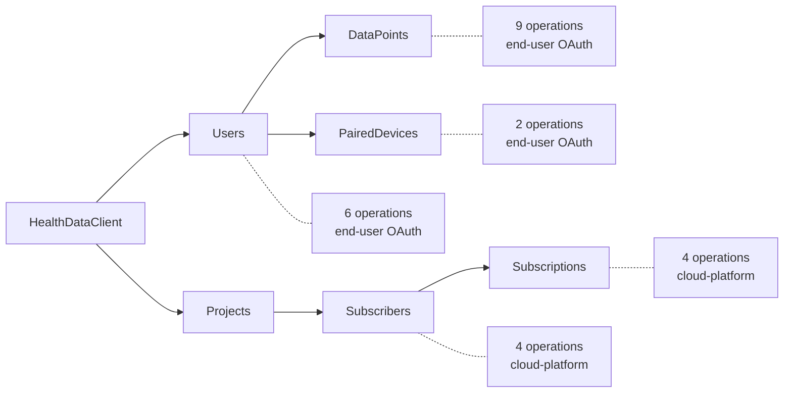

# Operations

The 25 operations this SDK exposes from Google Health API `v4`, Discovery revision `20260805`.

This table is maintained by hand from the committed snapshot. The descriptors it describes are
generated — they are available at runtime on `HealthDataGeneratedOperations`, and those cannot
drift from the contract — but nothing regenerates or checks this page, so treat the code as the
answer where the two disagree.

**Retry** is a design decision of this SDK, not something Google publishes:

| Classification | Meaning |
|---|---|
| `Safe` | Read-only. Retried when retry is enabled |
| `Idempotent` | Repeating it converges on the same state |
| `SemanticallySafe` | Computes a projection without storing anything |
| `Never` | A write that must not be resent automatically |

Retry is opt-in in all cases; how to turn it on is in [runtime.md](runtime.md#retry). What a
change to any of this means for the package version is in
[compatibility.md](compatibility.md).



## `client.Users`

Scope names are shown without the `https://www.googleapis.com/auth/googlehealth.` prefix.

| Method | HTTP | Path | Returns | Scope | Retry |
|---|---|---|---|---|---|
| `GetProfileAsync` | GET | `v4/{+name}` | `Profile` | `profile.readonly` | `Safe` |
| `GetSettingsAsync` | GET | `v4/{+name}` | `Settings` | `settings.readonly` | `Safe` |
| `GetIdentityAsync` | GET | `v4/{+name}` | `Identity` | any of 7 read scopes | `Safe` |
| `GetIrnProfileAsync` | GET | `v4/{+name}` | `IrnProfile` | `irn.readonly` | `Safe` |
| `UpdateProfileAsync` | PATCH | `v4/{+name}` | `Profile` | `profile.writeonly` | `Never` |
| `UpdateSettingsAsync` | PATCH | `v4/{+name}` | `Settings` | `settings.writeonly` | `Never` |

The resource names are fixed by Discovery: `users/{user}/profile`, `.../settings`,
`.../identity`, `.../irnProfile`.

## `client.Users.DataPoints`

The `dataTypes` path segment is flattened away in C#, because it declares no methods of its own —
the data type is selected through the parent resource name, for example
`users/me/dataTypes/heart-rate`. The measurement model itself, filters, timestamps and the data
type catalogue are in [data-points.md](data-points.md).

| Method | HTTP | Path | Returns | Retry |
|---|---|---|---|---|
| `GetAsync` | GET | `v4/{+name}` | `DataPoint` | `Safe` |
| `ListAsync` | GET | `v4/{+parent}/dataPoints` | `ListDataPointsResponse` | `Safe` |
| `ReconcileAsync` | GET | `v4/{+parent}/dataPoints:reconcile` | `ReconcileDataPointsResponse` | `Safe` |
| `RollUpAsync` | POST | `v4/{+parent}/dataPoints:rollUp` | `RollUpDataPointsResponse` | `SemanticallySafe` |
| `DailyRollUpAsync` | POST | `v4/{+parent}/dataPoints:dailyRollUp` | `DailyRollUpDataPointsResponse` | `SemanticallySafe` |
| `ExportExerciseTcxAsync` | GET | `v4/{+name}:exportExerciseTcx` | `ExportExerciseTcxResponse` or a stream | `Safe` |
| `CreateAsync` | POST | `v4/{+parent}/dataPoints` | `Operation` | `Never` |
| `PatchAsync` | PATCH | `v4/{+name}` | `Operation` | `Never` |
| `BatchDeleteAsync` | POST | `v4/{+parent}/dataPoints:batchDelete` | `Operation` | `Never` |

Scope groups:

| Group | Scopes | Used by |
|---|---|---|
| read | `activity_and_fitness` · `health_metrics_and_measurements` · `location` · `nutrition` · `sleep`, all `.readonly` | `Get`, `RollUp`, `DailyRollUp` |
| read, wider | the five above plus `ecg.readonly` and `irn.readonly` | `List` |
| write | `activity_and_fitness` · `health_metrics_and_measurements` · `location` · `logged_symptoms` · `mindfulness` · `nutrition` · `reproductive_health` · `sleep`, all `.writeonly` | `Create`, `Patch`, `BatchDelete` |
| TCX | `activity_and_fitness.readonly` **and** `location.readonly` | `ExportExerciseTcx` |
| reconcile | all thirteen read and write scopes | `Reconcile` |

A Discovery `scopes` array means **any one** of the listed scopes is accepted, not all of them —
with a single documented exception. `ExportExerciseTcx` needs both of its scopes together, which
its [per-method reference](https://developers.google.com/health/reference/rest/v4/users.dataTypes.dataPoints/exportExerciseTcx)
states and Discovery cannot express. See
[authentication.md](authentication.md#one-operation-needs-two-scopes-at-once).

Things worth knowing, each verified against Discovery rather than a guide:

- `Reconcile` is a **GET**. It is a merge view with no side effects, despite the `:reconcile` verb.
- `Patch` has **no** `updateMask` parameter, unlike every other patch in this API.
- A `GoogleFieldMask` that names no fields is **refused**, both by `Parse("")` and when a request
  carrying one is built. Omitting the mask is a documented request under
  [AIP-134](https://google.aip.dev/134) — "replace fields which are present" — while the wire
  meaning of an empty mask is undefined: `field_mask.proto` says implementations differ and tells
  service authors to special-case it. Converting one into the other silently is what this used to
  do.
- `ExportExerciseTcx` is dual-natured: it returns JSON, or the TCX document itself when the
  request asks for media. Both overloads are generated.
- `RollUp` carries its page size and token **inside the request body** rather than the query. It
  still gets an `EnumerateAsync` helper: where the cursor travels is a detail of the request, and
  its response returns a next page token like any other list.
- `DailyRollUp` accepts a page token and its response **never returns one**, so it is the one
  operation with no `EnumerateAsync`. There is nothing to follow. The generated model says so on
  the property itself.

## `client.Users.PairedDevices`

| Method | HTTP | Path | Returns | Scope | Retry |
|---|---|---|---|---|---|
| `GetAsync` | GET | `v4/{+name}` | `PairedDevice` | `settings.readonly` | `Safe` |
| `ListAsync` | GET | `v4/{+parent}/pairedDevices` | `ListPairedDevicesResponse` | `settings.readonly` | `Safe` |

## `client.Projects.Subscribers`

These use project or IAM credentials — `https://www.googleapis.com/auth/cloud-platform` — not an
end-user OAuth grant. A provider that returns a user token here gets a 403.

| Method | HTTP | Path | Returns | Retry |
|---|---|---|---|---|
| `ListAsync` | GET | `v4/{+parent}/subscribers` | `ListSubscribersResponse` | `Safe` |
| `CreateAsync` | POST | `v4/{+parent}/subscribers` | `Operation` | `Never` |
| `PatchAsync` | PATCH | `v4/{+name}` | `Operation` | `Never` |
| `DeleteAsync` | DELETE | `v4/{+name}` | `Operation` | `Idempotent` |

Subscriber writes return an `Operation`, even though the Webhooks guide shows a `Subscriber`
coming back directly. Discovery and the per-method reference agree on `Operation`, and Discovery
is the contract the service enforces — one of the recorded
[documentation conflicts](architecture.md#known-documentation-conflicts).

## `client.Projects.Subscribers.Subscriptions`

Also `cloud-platform`.

| Method | HTTP | Path | Returns | Retry |
|---|---|---|---|---|
| `ListAsync` | GET | `v4/{+parent}/subscriptions` | `ListSubscriptionsResponse` | `Safe` |
| `CreateAsync` | POST | `v4/{+parent}/subscriptions` | `Subscription` | `Never` |
| `PatchAsync` | PATCH | `v4/{+name}` | `Subscription` | `Never` |
| `DeleteAsync` | DELETE | `v4/{+name}` | *(no content)* | `Idempotent` |

Subscription writes do **not** return an `Operation`, unlike subscriber writes. The asymmetry is
Google's, and it is reproduced rather than smoothed over.

## Pagination

Every operation whose response carries `nextPageToken` gets an `EnumerateAsync` overload that
follows the cursor:

```csharp
await foreach (var point in client.Users.DataPoints.EnumerateAsync(
    new ListDataPointsRequest { Parent = UserName.Me.DataType("heart-rate") },
    cancellationToken))
{
    // one page is held in memory at a time
}
```

`ListAsync` remains available for callers that want to drive the cursor themselves; enumeration
is purely additive and costs effectively nothing over it. See
[runtime.md](runtime.md#performance-baseline).

### Following the cursor can return fewer records than exist

**The service drops records that share a timestamp with the last record of a page.** When a page
boundary falls inside a group of records stamped at the same instant, the rest of that group is
skipped and never sent. Enumeration ends normally — `nextPageToken` simply stops arriving — and no
duplicate is ever returned, so nothing about the result says it is short.

**What decides your exposure is how tied the data is, not how small the page is.** A type recorded
through the day seldom has two records on the same instant, so few boundaries can land on a tie —
less exposed, not immune. A type whose entries are all stamped at the same time each day, which is
how some sources record a daily total, ties constantly, and then almost any boundary lands on one.
A larger page is not a guarantee either: it moves where the boundaries fall rather than removing
them.

This SDK cannot repair it. `EnumerateAsync` returns exactly what the same cursor returns when it is
walked by hand — the same records, in the same order. A record the service does not send cannot be
recovered by de-duplicating or retrying, and raising `PageSize` behind the caller's back would
ignore what they asked for without fixing anything.

If completeness matters — reconciling a person's record, or anything a number is computed from —
narrow the range until `ListAsync` answers with an empty `NextPageToken`, and take that page. A
result that needed no second page cannot have lost anything at a boundary, because it had none.

## Not exposed

Two Discovery operations are deliberately excluded, recorded with a reason in
`spec/v4/public-surface.json`:

| Operation | Why |
|---|---|
| `health.shl.m.getShlManifest` | SMART Health Links. Absent from the public REST reference, declares no OAuth scope, and FHIR-adjacent surface is an explicit non-goal |
| `health.shl.r.get` | Same |

An operation appearing in Discovery is not sufficient reason to make it public. If Google adds one
that the allowlist does not classify, generation warns and a test fails, so the decision happens
in review rather than by default.
