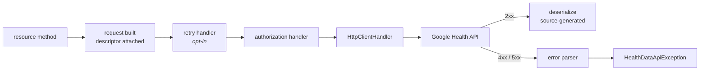
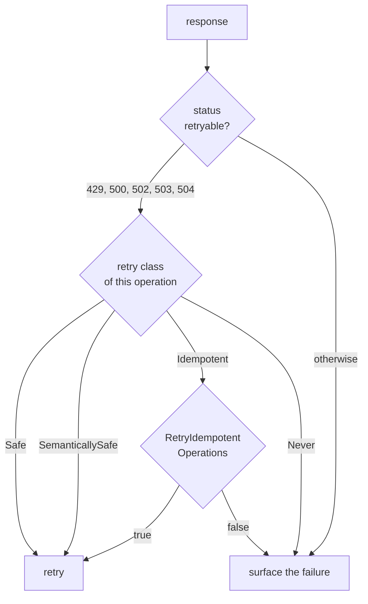

# Runtime behaviour

What happens between calling a generated method and getting a value back: errors, retry,
diagnostics, and what the SDK guarantees under Native AOT.



Retry sits outside authorization on purpose: every attempt resolves a fresh token, so an attempt
never carries one that expired while an earlier attempt was in flight.

## Errors

Any non-success status becomes a `HealthDataApiException`.

| Member | Value |
|---|---|
| `StatusCode` | The HTTP status |
| `OperationId` | The Discovery operation id that failed, when known |
| `Reason` | The machine-readable reason, for example `MISSING_OAUTH_SCOPE`. Passed through as the service sent it, including values this contract does not document — it is for branching on |
| `RetryAfter` | The server's requested wait, when it sent one |
| `IsRateLimited` | True when the status was `429 Too Many Requests` |
| `Error` | The full parsed envelope |

```csharp
try
{
    var profile = await client.Users.GetProfileAsync(request, cancellationToken);
}
catch (HealthDataApiException ex) when (
    ex.Reason is HealthDataErrorReasons.MissingOauthScope or "ACCESS_TOKEN_SCOPE_INSUFFICIENT")
{
    // The grant is missing a scope this operation needs. Re-consent; retrying will not help.
    // Both, because a scope can be refused in two places — see below.
}
catch (HealthDataApiException ex) when (ex.IsRateLimited)
{
    await Task.Delay(ex.RetryAfter ?? TimeSpan.FromSeconds(30), cancellationToken);
}
```

**The exception message contains only the operation id, the status, and the reason when this
contract documents that reason.** Google's own error messages quote user ids and data types, and an
exception message is the string most likely to end up in a log. A reason the contract does not
document is left out of the message and stays on `Reason` and `Error`, for callers with somewhere
safe to put it.

### A missing scope is refused in two places, and only one of them is in the catalogue

`MISSING_OAUTH_SCOPE` is the reason Google's error catalogue documents, so it is a constant on
`HealthDataErrorReasons` and it reaches the exception message.

A token that carries **none** of an operation's accepted scopes never reaches the Health service at
all. Google's front end refuses it first, with `PERMISSION_DENIED` and the reason
`ACCESS_TOKEN_SCOPE_INSUFFICIENT` — which is not in the catalogue, so there is no constant for it
and it does not appear in the exception message. Its `ErrorInfo.metadata` carries `service` and
`method`, naming the RPC that was refused, rather than the scope that was missing.

There is no constant for it on purpose. `HealthDataErrorReasons` is generated from the catalogue
snapshot in `spec/v4`, and adding a value Google did not publish there would put something in the
contract that is not in the contract. Compare the string, and know why it is a string.

```csharp
// Reason is unfiltered, so this matches whichever layer did the refusing.
catch (HealthDataApiException ex) when (
    ex.Reason is HealthDataErrorReasons.MissingOauthScope or "ACCESS_TOKEN_SCOPE_INSUFFICIENT")
```

Branching on the message instead would miss the second one entirely, which is the more likely of
the two to be what an application actually meets: it is what a grant that was never asked for the
scope produces.

### Where the reason comes from

Google returns an AIP-193 envelope. The API-specific reason lives in `details[].ErrorInfo.reason`;
`status` carries the canonical code:

```json
{
  "error": {
    "code": 403,
    "status": "PERMISSION_DENIED",
    "message": "...",
    "details": [
      { "@type": "type.googleapis.com/google.rpc.ErrorInfo", "reason": "MISSING_OAUTH_SCOPE" }
    ]
  }
}
```

`Reason` prefers `ErrorInfo.reason` and falls back to `status`. It is null only when the response
carried neither, which is a response that said nothing about why it failed — rare, and worth
handling rather than assuming away.

Reasons are `const string` on `HealthDataErrorReasons`, not an enum: the service can return one
this SDK has never heard of, and an unknown reason must pass through unchanged
([ADR-0005](adr/0005-open-enums.md)). 58 are catalogued.

`HealthDataErrorDetail` exposes the parsed detail entries — `IsErrorInfo`, `IsRetryInfo`,
`RetryDelay` — with `Raw` preserving the original `JsonElement` for any type not modelled.

### The error body is bounded

`HealthDataClientOptions.MaxErrorResponseBytes` defaults to 64 KB. An error body is
attacker-influenced in the general case and is never buffered without a bound. A truncated body
still yields the status and whatever was parsed.

## Retry

**Retry is opt-in.** Nothing is retried unless a `HealthDataRetryHandler` is in the pipeline. A
client that silently re-sends writes is a liability on an API that stores health data.

```csharp
services.AddHealthData(options => options.Retry = new HealthDataRetryOptions
{
    MaxAttempts = 3,
    BaseDelay = TimeSpan.FromSeconds(1),
    MaxDelay = TimeSpan.FromSeconds(30),
    UseJitter = true,
    RetryIdempotentOperations = false,
});
```

| Option | Default | Meaning |
|---|---|---|
| `MaxAttempts` | `3` | Total attempts, not additional ones |
| `BaseDelay` | 1 s | First backoff interval |
| `MaxDelay` | 30 s | The longest this handler will wait between attempts |
| `UseJitter` | `true` | Full jitter: a uniform draw over the whole interval |
| `RetryIdempotentOperations` | `false` | Whether `Idempotent` operations are retried too |

What gets retried is decided from the operation descriptor, not the URL:



`Idempotent` is off by default because a `DELETE` that actually succeeded and lost its response
reports "not found" on the retry, which most callers would rather see as the original failure.

A `Retry-After` header wins over the computed backoff, and is taken at face value: the service
knows when its quota window resets. It is never shortened to fit `MaxDelay`, because retrying
early arrives at a service that has just said it is not ready — RFC 9110 defines the field as how
long the client ought to wait. If the server asks for longer than `MaxDelay`, the handler stops
instead of retrying sooner, and the response reaches the caller with its `Retry-After` intact on
`HealthDataApiException.RetryAfter`:

```csharp
catch (HealthDataApiException ex) when (ex.IsRateLimited && ex.RetryAfter is { } wait)
{
    // Longer than the handler was willing to sit through. Schedule it rather than spin.
    await scheduler.RetryAfterAsync(wait, cancellationToken);
}
```

The classification per operation is in [operations.md](operations.md).

Backoff uses an injected `TimeProvider` — including the arithmetic for a `Retry-After` sent as an
HTTP-date, which is the branch most likely to be left reading the wall clock. Tests exercise the
whole schedule without spending real seconds.

## Long-running operations

Six of the 25 operations return an `Operation` rather than the value they wrote: everything under
`projects.subscribers` except `list`, and `dataPoints` `create`, `patch` and `batchDelete`.

```csharp
var operation = await client.Users.DataPoints.CreateAsync(request, cancellationToken);

if (operation.IsSucceeded())
{
    var written = operation.TryGetResponse<DataPoint>();
}
else if (operation.IsFailed())
{
    // operation.Error is a Status: code, message, and details.
}
```

| Member | Meaning |
|---|---|
| `Done` | Whether the operation finished. `null` is not the same as `false` |
| `Response` | The result, as a `JsonElement`, when it succeeded |
| `Error` | A `Status` when it failed |
| `Metadata` | Service-defined progress information, as a `JsonElement` |
| `IsSucceeded()` | `Done == true` and no `Error` |
| `IsFailed()` | `Done == true` and an `Error` |
| `TryGetResponse<T>()` / `TryGetMetadata<T>()` | Decodes the payload as a generated model |
| `TryGetResponse<T>(JsonTypeInfo<T>)` | The same, for a type outside this contract |

`Response` and `Metadata` are `JsonElement` because Discovery types them as `additionalProperties`
with no schema — there is nothing to generate. The parameterless overloads resolve `T` through the
generated serializer context, so a type outside the contract fails loudly rather than working
under the JIT and breaking under Native AOT. The payload is a `google.protobuf.Any` and carries an
`@type` field with no C# counterpart; it is ignored rather than rejected.

**There is no polling resource, and none is invented.** Google's API exposes no
`operations.get`, so this SDK does not generate an `OperationsResource` that would have to guess a
path. If you receive an operation with `Done` unset, re-read the affected resource rather than
polling an endpoint that does not exist.

Whether `Done` is ever `false` in practice is an open question that documentation cannot settle;
it is recorded as needing an integration test rather than asserted either way.

## Diagnostics

The core takes no logging dependency. It emits `ActivitySource` events under
`Kkdev92.HealthData`:

```csharp
using var listener = new ActivityListener
{
    ShouldListenTo = source => source.Name == HealthDataDiagnostics.SourceName,
    Sample = (ref ActivityCreationOptions<ActivityContext> _) => ActivitySamplingResult.AllData,
    ActivityStarted = activity => Console.WriteLine(activity.DisplayName),
};

ActivitySource.AddActivityListener(listener);
```

OpenTelemetry picks the source up by name:

```csharp
builder.Services.AddOpenTelemetry()
    .WithTracing(tracing => tracing.AddSource(HealthDataDiagnostics.SourceName));
```

| Emitted | Never emitted |
|---|---|
| `googlehealth.operation_id` | User ids, data point ids |
| `googlehealth.api_version` | Resource names — one embeds both the user and the data type |
| `http.request.method`, `server.address` | Filter expressions, request or response bodies |
| `http.response.status_code`, `error.type` | TCX payloads, access or refresh tokens |
| `retry.attempt` | |

There is no URL tag at all. The tag list is short deliberately, and a test enforces it.

The activity wraps the whole operation, so it starts before `System.Net.Http`'s own instrumentation
and outlives it — it covers reading and deserializing the response, not just the exchange. Note
that .NET's built-in HTTP instrumentation does record the request URI, which for this API embeds a
user identifier; configure it accordingly.

## Response size

`PrettyPrintResponses` defaults to `false`, which sends `prettyPrint=false`. Google's server-side
default is `true`, indenting every response. Measured against the Discovery endpoint on
2026-08-10, turning it off cut a payload from 282,943 to 207,058 bytes — **26.8% fewer bytes** for
a whitespace-only difference. A second Google endpoint showed 16.3%.

Set it to `true` to accept the service default, which is convenient when capturing traffic by hand.

## Native AOT and trimming

The shipping packages are `IsAotCompatible`, and CI publishes a real consumer application with
`PublishAot=true` — a library that merely builds is not evidence of AOT compatibility.

- `JsonSerializerIsReflectionEnabledByDefault` is `false` in the packages and in the AOT smoke
  app. A missing `[JsonSerializable]` fails loudly instead of silently falling back to reflection
  and breaking only at run time under AOT.
- All serialization goes through the generated `HealthDataJsonContext` in metadata mode; the
  write contract is applied with a contract modifier rather than a second set of types
  ([ADR-0006](adr/0006-write-contract-excludes-read-only-fields.md)).
- The trim and AOT analyzers report no `IL2026` or `IL3050` warnings across the packages.

Nothing in the public surface requires a consumer to add a `TrimmerRootDescriptor`.

## Performance baseline

Client-side overhead is measured and recorded in
[`../benchmarks/BASELINE.md`](../benchmarks/BASELINE.md). Two results worth knowing here: open
enums cost nothing measurable and allocate zero bytes, and `EnumerateAsync` costs about 0.1% more
allocation than driving the page token by hand, which is why the raw list call stays primary and
enumeration is purely additive.
