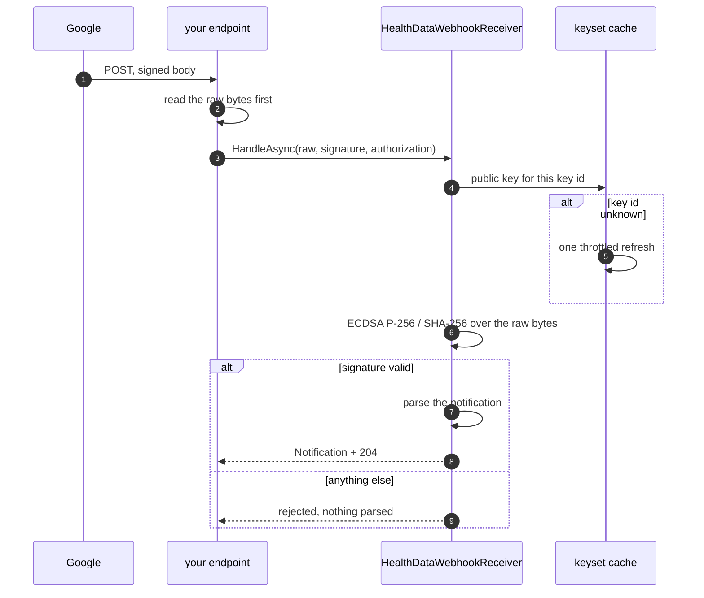

# Webhooks

Receiving and verifying Google Health API notifications.

## Wire format

Verified against Google's published keyset and Tink's own source on 2026-08-10:

```text
signature header   GOOGLE-HEALTH-API-SIGNATURE   (base64)
decoded            [0x01][keyId big-endian, 4 bytes][DER ECDSA signature]
algorithm          ECDSA P-256 with SHA-256
signed data        the raw request body, exactly as received
keyset             https://www.gstatic.com/googlehealthapi/webhooks/webhooks_public_keyset.json
key rotation       every 30 days
```

The five-byte prefix is a key hint, not part of the signature. Tink appends a `0x00` byte to the
signed message only for the `LEGACY` output prefix type; Google publishes `TINK` keys, so the
signature covers the body unchanged. That distinction is in Tink's `LegacyFullVerify`
([`LegacyFullVerify.java`](https://github.com/tink-crypto/tink-java/blob/bc7cd1c44664a4fd8d016bfe52e189139cdb437e/src/main/java/com/google/crypto/tink/signature/internal/LegacyFullVerify.java)
in [tink-crypto/tink-java](https://github.com/tink-crypto/tink-java) at commit `bc7cd1c`).

> Copyright 2024 Google LLC. Licensed under the Apache License, Version 2.0; a copy is in
> [`third_party/licenses/tink-java-Apache-2.0.txt`](../third_party/licenses/tink-java-Apache-2.0.txt).
> **Modified**: the braces are closed up onto fewer lines. The logic is unchanged.

A commit permalink rather than `main`, so that what is quoted here stays what is at the other end
of the link.

```java
static byte[] getMessageSuffix(ProtoKeySerialization key) {
  if (key.getOutputPrefixType().equals(OutputPrefixType.LEGACY)) return new byte[] {0};
  return new byte[0];
}
```

**No Tink dependency is needed.** `System.Security.Cryptography` verifies a DER signature directly
via `DSASignatureFormat.Rfc3279DerSequence`, and the `EcdsaPublicKey` protobuf inside the keyset
needs only three fields read. This package has zero third-party runtime dependencies
([ADR-0002](adr/0002-no-google-apis-runtime-dependency.md)).

One trap worth naming: Tink stores the curve coordinates as protobuf `bytes` holding a big-endian
integer, so a coordinate whose high bit is set arrives with a leading `0x00` sign byte and is 33
bytes long. Handing that straight to `ECParameters` produces an invalid key. Every key in the live
keyset is 33 bytes today.

## Receive, verify, then parse



The order is mandatory and this package makes it structural. `WebhookRequestResult.Notification`
is populated only when the signature verified, so there is no parsed notification to mistake for a
trustworthy one.

### Composing the receiver

Three objects, one direction. The key provider fetches and caches Google's keyset, the verifier
checks a signature against it, and the receiver decides what the request was.

```csharp
// A singleton, deliberately: the cache and the shared in-flight fetch are the whole point of the
// provider, and one per application is what makes them work.
//
// Which is why its HttpClient is built here rather than taken from AddHttpClient<T>. A typed
// client injected into a singleton is captured for that singleton's lifetime, and
// IHttpClientFactory then cannot rotate its handler — so the client stops noticing DNS changes.
// Microsoft's guidance says not to do that; for a client you intend to keep, the answer is
// SocketsHttpHandler with a PooledConnectionLifetime, which recycles connections a level lower.
builder.Services.AddSingleton(_ => new HealthDataWebhookKeyProvider(
    new HttpClient(new SocketsHttpHandler { PooledConnectionLifetime = TimeSpan.FromMinutes(5) })));

builder.Services.AddSingleton(sp => new HealthDataWebhookSignatureVerifier(
    sp.GetRequiredService<HealthDataWebhookKeyProvider>()));

builder.Services.AddSingleton(sp => new HealthDataWebhookReceiver(
    sp.GetRequiredService<HealthDataWebhookSignatureVerifier>(),

    // The secret configured on the subscriber. Leave it out and every request is refused,
    // including the verification challenge — which is the safe default, and not a working
    // endpoint.
    builder.Configuration["GoogleHealth:WebhookEndpointSecret"]));
```

### Rotating the endpoint secret

The secret changes at Google and in the application at two different moments, and Google keeps
delivering in between. Accepting both for the length of that window is the difference between a
rotation and an outage:

```csharp
new HealthDataWebhookReceiver(verifier, new[] { currentSecret, previousSecret });
```

Every candidate is compared, so the time taken does not say which one matched. Drop the old one
once nothing is arriving with it.

This is a different thing from the signing key rotation below: that one is Google's and the SDK
follows it for you, this one is yours.

### The endpoint

```csharp
// This endpoint is on the public internet and anyone can post to it, so how much arrives is the
// sender's choice rather than yours. A notification is a few kilobytes; this is a ceiling, not an
// expectation.
const int MaximumBodyBytes = 64 * 1024;

app.MapPost("/google-health/webhook", async (HttpRequest request, HealthDataWebhookReceiver receiver, CancellationToken ct) =>
{
    // The raw bytes, before any model binding. Re-serializing changes whitespace and key order,
    // and the signature will never match.
    if (await ReadBoundedAsync(request, MaximumBodyBytes, ct) is not { } body)
    {
        return Results.StatusCode(StatusCodes.Status413RequestEntityTooLarge);
    }

    var result = await receiver.HandleAsync(
        body,
        request.Headers[HealthDataWebhookSignatureVerifier.SignatureHeaderName],
        request.Headers.Authorization,
        ct);

    if (result.Kind is WebhookRequestKind.Notification)
    {
        // Capture, then acknowledge — not the other way round. The 204 is what stops Google
        // retrying, so anything lost before it is sent is lost for good. This must stay a small
        // durable write: the guide requires a prompt 204, and a slow handler is retried, which
        // means the same notification arrives twice. The processing happens off this thread.
        await queue.EnqueueAsync(result.Notification!, ct);
    }

    return Results.StatusCode((int)result.StatusCode);
});

// Null once the limit is passed, rather than reading the rest to find out by how much. The
// declared length is checked first so that the common refusal costs nothing, and the read is
// checked too, because a chunked request declares no length at all.
static async Task<byte[]?> ReadBoundedAsync(HttpRequest request, int limit, CancellationToken ct)
{
    if (request.ContentLength > limit)
    {
        return null;
    }

    using var buffer = new MemoryStream();
    var chunk = new byte[8192];
    int read;

    while ((read = await request.Body.ReadAsync(chunk, ct)) > 0)
    {
        if (buffer.Length + read > limit)
        {
            return null;
        }

        buffer.Write(chunk, 0, read);
    }

    return buffer.ToArray();
}
```

If you use ASP.NET Core, disable model binding on this endpoint or enable request buffering.
Anything that reads the body before you do will leave you with nothing to verify.

The limit above is the endpoint's own. Kestrel has one as well — `MaxRequestBodySize`, which
defaults to 30,000,000 bytes — and it applies to every endpoint in the application. Both are worth
having: the server limit stops a request that is absurd, and this one refuses what a notification
could not possibly be.

## Endpoint verification

Google verifies an endpoint by sending two challenges, both with body `{"type": "verification"}`
and user agent `Google-Health-API-Webhooks`. One carries the `Authorization` credential you
configured on the subscriber, one does not. Accepting both would prove the endpoint is an open
relay.

| Request | Expected response | This package returns |
|---|---|---|
| Authorized challenge | `200 OK` or `201 Created` | `201 Created` |
| Unauthorized challenge | `401` or `403` | `401 Unauthorized` |
| Notification | `204 No Content`, immediately | `204 No Content` |

`201` is used for the authorized challenge because the per-method reference requires exactly that
while the guide allows either; the stricter value satisfies both. See the recorded
[documentation conflicts](architecture.md#known-documentation-conflicts).

The credential is compared in fixed time. It is a shared secret, and a comparison that returns
early leaks it a byte at a time.

## Key rotation and failure behaviour

| Situation | Behaviour |
|---|---|
| Key id not in the cached keyset | One refresh, then reject if still unknown |
| Refresh throttle | One minute minimum between forced refreshes |
| Cache lifetime | Six hours, well inside the 30-day rotation |
| Fetch fails, keys cached, under 24 hours old | Keep verifying with the cached keys |
| Fetch fails, keys cached, over 24 hours old | Throw. The keys are no longer evidence of anything |
| Fetch fails, nothing cached | Throw; there is no safe fallback |
| The caller cancels | Throw. Cancelling is not a request for an older answer |
| Signature unverifiable for any reason | **Reject.** Fail closed, always |

"Fetch fails" covers every way the request can come back without a keyset in it, not only a refused
connection: a CDN answering `200` with an error page, a response that stops half way, key material
that is not valid Base64. All of them mean the same thing to a caller.

The 24-hour limit is the one to think about before changing. Google rotates every 30 days and
withdraws a key sooner than that if it is compromised, so a provider that survived every failure
indefinitely would go on verifying against a withdrawn key for as long as the network stayed
broken — availability bought with the only property this class exists to protect. Both durations
are constructor arguments; the stale limit cannot be shorter than the cache lifetime.

The refresh throttle matters for more than politeness: without it, a flood of forged signatures
naming random key ids turns your endpoint into a request amplifier against `gstatic.com`.

## Notification payload

Handwritten models, not generated: the payload has no schema in the Discovery document, so there
is nothing to generate them from. The similarly named `...WebhookNotificationCloudLog` in
Discovery is a Cloud Logging record, not this.

```json
{
  "data": {
    "version": "1",
    "clientProvidedSubscriptionName": "...",
    "healthUserId": "...",
    "operation": "UPSERT",
    "dataType": "steps",
    "intervals": [
      {
        "physicalTimeInterval":     { "startTime": "...", "endTime": "..." },
        "civilDateTimeInterval":    { "startDateTime": { "date": {...}, "time": {...} }, "endDateTime": {...} },
        "civilIso8601TimeInterval": { "startTime": "2026-03-07T17:29:00", "endTime": "..." }
      }
    ]
  }
}
```

`operation` is `UPSERT` for any addition or modification and `DELETE` when a user deletes data. It
is surfaced as a string rather than an enum, for the same reason wire enums are open elsewhere: a
value added later must not break an existing receiver ([ADR-0005](adr/0005-open-enums.md)).

A notification says only *that* something changed and *when*. Read the data back through the API;
the notification carries no measurements.

## Delivery semantics

**Delivery is at-least-once.** Everything below is Google's documented behaviour, not this SDK's,
and none of it can be changed from the receiving side — so the receiver has to be built for it.

| Behaviour | What Google's guide says |
|---|---|
| Duplicates | Retries can cause the same notification to be delivered more than once |
| Retry trigger | Any status other than `204`, or a timeout |
| Backoff | Exponential |
| Pending storage | Up to **7 days** while the endpoint is unavailable |
| Recovery | Once the endpoint answers `204` again, the stored backlog is delivered |
| Loss | Notifications older than 7 days are discarded and cannot be recovered |
| Batching | Up to **99 messages** per batch, pushed as they become available |

Four consequences worth designing for:

- **Make processing idempotent.** Google recommends this explicitly, especially for `UPSERT`. A
  handler that increments a counter or enqueues a downstream job will do it twice.
- **Answer `204` quickly and do the work elsewhere.** The response is an acknowledgement, not a
  result. Anything slow inside the handler risks a timeout, and a timeout is a retry — which is to
  say, a duplicate.
- **Expect a burst after an outage.** A recovered endpoint receives up to seven days of backlog as
  fast as it can be delivered. Whatever the handler enqueues into needs to absorb that.
- **Treat a notification as a signal, not a record.** It carries no measurements, and 7-day
  expiry means the stream is not a complete history. Re-read from the API; that is the source of
  truth.

The sample above enqueues before answering `204`, which is deliberate: acknowledging first and
enqueuing after would lose the notification if the enqueue failed, and Google's retry only helps
while the response is not yet `204`. Keep that enqueue small and bounded — a durable write, not
the processing — and return a non-`204` if it fails, so the retry does its job.

## Privacy

`healthUserId` is a user identifier and `dataType` reveals a health category. Neither belongs in a
log, and neither does the raw payload — including while debugging. The wider rule, and what the
SDK itself emits, is in [runtime.md](runtime.md#diagnostics).
